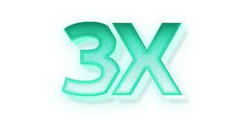

[English](/README.md) | [فارسی](/README.fa_IR.md) | [العربية](/README.ar_EG.md) |  [中文](/README.zh_CN.md) | [Español](/README.es_ES.md) | [Русский](/README.ru_RU.md)

<p align="center">
  <picture>
    <source media="(prefers-color-scheme: dark)" srcset="./media/3x-ui-dark.png">
    
  </picture>
</p>

[](https://github.com/MHSanaei/3x-ui/releases)
[](https://github.com/MHSanaei/3x-ui/actions)
[](#)
[](https://github.com/MHSanaei/3x-ui/releases/latest)
[](https://www.gnu.org/licenses/gpl-3.0.en.html)
[](https://pkg.go.dev/github.com/mhsanaei/3x-ui/v2)
[](https://goreportcard.com/report/github.com/mhsanaei/3x-ui/v2)

**3X-UI** — لوحة تحكم متقدمة مفتوحة المصدر تعتمد على الويب مصممة لإدارة خادم Xray-core. توفر واجهة سهلة الاستخدام لتكوين ومراقبة بروتوكولات VPN والوكيل المختلفة.

> [!IMPORTANT]
> هذا المشروع مخصص للاستخدام الشخصي والاتصال فقط، يرجى عدم استخدامه لأغراض غير قانونية، يرجى عدم استخدامه في بيئة الإنتاج.

كمشروع محسن من مشروع X-UI الأصلي، يوفر 3X-UI استقرارًا محسنًا ودعمًا أوسع للبروتوكولات وميزات إضافية.

## البدء السريع

```
bash <(curl -Ls https://raw.githubusercontent.com/mhsanaei/3x-ui/master/install.sh)
```

للحصول على الوثائق الكاملة، يرجى زيارة [ويكي المشروع](https://github.com/MHSanaei/3x-ui/wiki).

## شكر خاص إلى

- [alireza0](https://github.com/alireza0/)

## الاعتراف

- [Iran v2ray rules](https://github.com/chocolate4u/Iran-v2ray-rules) (الترخيص: **GPL-3.0**): _قواعد توجيه v2ray/xray و v2ray/xray-clients المحسنة مع النطاقات الإيرانية المدمجة وتركيز على الأمان وحظر الإعلانات._
- [Russia v2ray rules](https://github.com/runetfreedom/russia-v2ray-rules-dat) (الترخيص: **GPL-3.0**): _يحتوي هذا المستودع على قواعد توجيه V2Ray محدثة تلقائيًا بناءً على بيانات النطاقات والعناوين المحظورة في روسيا._

## دعم المشروع

**إذا كان هذا المشروع مفيدًا لك، فقد ترغب في إعطائه**:star2:

<a href="https://www.buymeacoffee.com/MHSanaei" target="_blank">

</a>
</br>
<a href="https://nowpayments.io/donation/hsanaei" target="_blank" rel="noreferrer noopener">
   
</a>

## النجوم عبر الزمن

[](https://starchart.cc/MHSanaei/3x-ui) 
