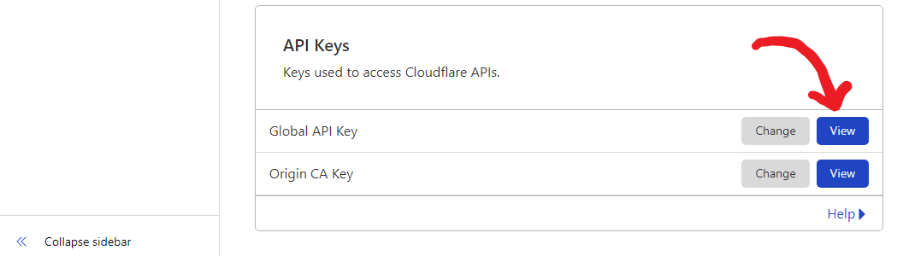
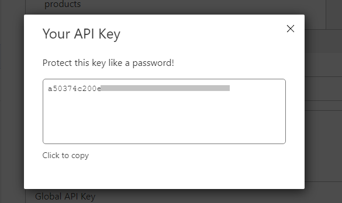
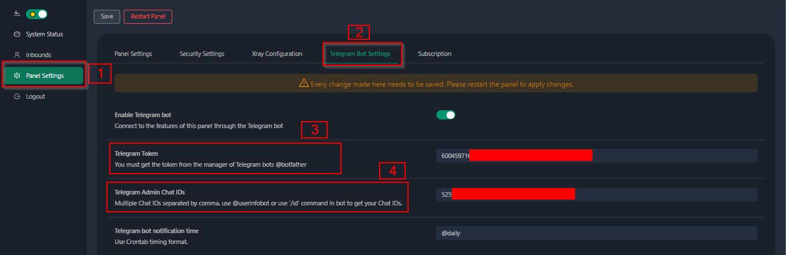
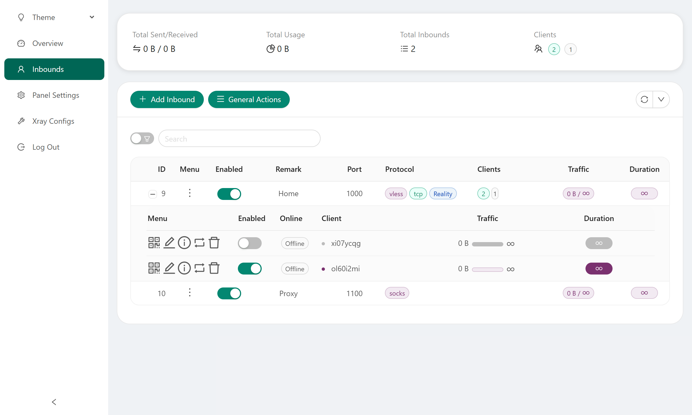

[English](/README.md) | [فارسی](/README.fa_IR.md) | [العربية](/README.ar_EG.md) |  [中文](/README.zh_CN.md) | [Español](/README.es_ES.md) | [Русский](/README.ru_RU.md)

<p align="center">
  <picture>
    <source media="(prefers-color-scheme: dark)" srcset="./media/3x-ui-dark.png">
    
  </picture>
</p>

**لوحة تحكم ويب متقدمة • مبنية على Xray Core**

[](https://github.com/MHSanaei/3x-ui/releases)
[](#)
[](#)
[](#)
[](https://www.gnu.org/licenses/gpl-3.0.en.html)

> **تنبيه:** المشروع ده للتعلم الشخصي والتواصل فقط. رجاءً استخدمه بشكل قانوني.

**لو المشروع عجبك وساعدك، ممكن تدعمنا بعمل** :star2:

<p align="left">
  <a href="https://buymeacoffee.com/mhsanaei" target="_blank">
    
  </a>
</p>

- USDT (TRC20): `TXncxkvhkDWGts487Pjqq1qT9JmwRUz8CC`
- MATIC (polygon): `0x41C9548675D044c6Bfb425786C765bc37427256A`
- LTC (Litecoin): `ltc1q2ach7x6d2zq0n4l0t4zl7d7xe2s6fs7a3vspwv`

## التثبيت والتحديث

لتثبيت المشروع أو تحديثه، نفذ الأمر ده:
```bash
bash <(curl -Ls https://raw.githubusercontent.com/mhsanaei/3x-ui/master/install.sh)
```

## تثبيت النسخة القديمة (مش موصى بيها)

لو عايز تثبت نسخة معينة، استخدم الأمر ده، مثلاً نسخة `v1.7.9`:
```bash
VERSION=v1.7.9 && bash <(curl -Ls "https://raw.githubusercontent.com/mhsanaei/3x-ui/$VERSION/install.sh") $VERSION
```

## شهادة SSL

<details>
  <summary>اضغط لعرض تفاصيل شهادة SSL</summary>

### ACME

عشان تدير شهادات SSL باستخدام ACME:

1. تأكد إن الدومين بتاعك متربط صح بالسيرفر.
2. شغّل أمر `x-ui` في الترمينال واختار خيار "إدارة شهادات SSL".
3. هتلاقي الخيارات دي:
   - **Get SSL:** الحصول على شهادة SSL.
   - **Revoke:** إلغاء شهادة SSL موجودة.
   - **Force Renew:** تجديد شهادة SSL بالقوة.
   - **Show Existing Domains:** عرض كل شهادات الدومين المتوفرة على السيرفر.
   - **Set Certificate Paths for the Panel:** تعيين مسارات الشهادة عشان البانل يستخدمها.

### Certbot

لتثبيت واستخدام Certbot:
```sh
apt-get install certbot -y
certbot certonly --standalone --agree-tos --register-unsafely-without-email -d yourdomain.com
certbot renew --dry-run
```

### Cloudflare

السكريبت بتاع الإدارة فيه آلية مدمجة للتقديم على شهادة SSL من خلال Cloudflare. عشان تستخدمها، هتحتاج:
- بريد إلكتروني مسجل على Cloudflare.
- الـ Global API Key بتاع Cloudflare.
- الدومين لازم يكون مربوط للسيرفر الحالي عن طريق Cloudflare.

**كيفية الحصول على Global API Key من Cloudflare:**

1. شغّل أمر `x-ui` في الترمينال واختار "Cloudflare SSL Certificate".
2. ادخل على [Cloudflare API Tokens](https://dash.cloudflare.com/profile/api-tokens).
3. دوس على "View Global API Key" (شوف الصورة التوضيحية):
   
4. يمكن تحتاج تعيد تسجيل الدخول، وبعدها هتظهر الـ API Key (شوف الصورة التوضيحية):
   

عند الاستخدام، ادخل اسم الدومين، البريد الإلكتروني، وAPI Key. المخطط كالتالي:
   

</details>

## التثبيت والتحديث يدويًا

<details>
  <summary>اضغط لعرض تفاصيل التثبيت اليدوي</summary>

#### الاستخدام

1. لتحميل أحدث نسخة من الباكدج المظغوطة مباشرة على السيرفر، نفذ الأمر التالي:
```sh
ARCH=$(uname -m)
case "${ARCH}" in
  x86_64 | x64 | amd64) XUI_ARCH="amd64" ;;
  i*86 | x86) XUI_ARCH="386" ;;
  armv8* | armv8 | arm64 | aarch64) XUI_ARCH="arm64" ;;
  armv7* | armv7) XUI_ARCH="armv7" ;;
  armv6* | armv6) XUI_ARCH="armv6" ;;
  armv5* | armv5) XUI_ARCH="armv5" ;;
  s390x) echo 's390x' ;;
  *) XUI_ARCH="amd64" ;;
esac

wget https://github.com/MHSanaei/3x-ui/releases/latest/download/x-ui-linux-${XUI_ARCH}.tar.gz
```

2. بعد تحميل الباكدج، نفذ الأوامر دي للتثبيت أو التحديث:
```sh
ARCH=$(uname -m)
case "${ARCH}" in
  x86_64 | x64 | amd64) XUI_ARCH="amd64" ;;
  i*86 | x86) XUI_ARCH="386" ;;
  armv8* | armv8 | arm64 | aarch64) XUI_ARCH="arm64" ;;
  armv7* | armv7) XUI_ARCH="armv7" ;;
  armv6* | armv6) XUI_ARCH="armv6" ;;
  armv5* | armv5) XUI_ARCH="armv5" ;;
  s390x) echo 's390x' ;;
  *) XUI_ARCH="amd64" ;;
esac

cd /root/
rm -rf x-ui/ /usr/local/x-ui/ /usr/bin/x-ui
tar zxvf x-ui-linux-${XUI_ARCH}.tar.gz
chmod +x x-ui/x-ui x-ui/bin/xray-linux-* x-ui/x-ui.sh
cp x-ui/x-ui.sh /usr/bin/x-ui
cp -f x-ui/x-ui.service /etc/systemd/system/
mv x-ui/ /usr/local/
systemctl daemon-reload
systemctl enable x-ui
systemctl restart x-ui
```

</details>

## التثبيت باستخدام Docker

<details>
  <summary>اضغط لعرض تفاصيل Docker</summary>

#### الاستخدام

1. **تثبيت Docker:**
   ```sh
   bash <(curl -sSL https://get.docker.com)
   ```

2. **نسخ مستودع المشروع:**
   ```sh
   git clone https://github.com/MHSanaei/3x-ui.git
   cd 3x-ui
   ```

3. **تشغيل الخدمة:**
   ```sh
   docker compose up -d
   ```
   ممكن تضيف الخيار ```--pull always``` عشان Docker يسحب أحدث صورة لو موجودة. (راجع [مستندات Docker](https://docs.docker.com/reference/cli/docker/container/run/#pull) للمزيد من التفاصيل).

   **أو**
   ```sh
   docker run -itd \
      -e XRAY_VMESS_AEAD_FORCED=false \
      -v $PWD/db/:/etc/x-ui/ \
      -v $PWD/cert/:/root/cert/ \
      --network=host \
      --restart=unless-stopped \
      --name 3x-ui \
      ghcr.io/mhsanaei/3x-ui:latest
   ```

4. **التحديث إلى أحدث نسخة:**
   ```sh
   cd 3x-ui
   docker compose down
   docker compose pull 3x-ui
   docker compose up -d
   ```

5. **إزالة 3x-ui من Docker:**
   ```sh
   docker stop 3x-ui
   docker rm 3x-ui
   cd --
   rm -r 3x-ui
   ```

</details>

## إعدادات Nginx

<details>
  <summary>اضغط لعرض إعدادات البروكسي العكسي (Reverse Proxy)</summary>

#### Reverse Proxy باستخدام Nginx
```nginx
location / {
    proxy_set_header X-Forwarded-For $proxy_add_x_forwarded_for;
    proxy_set_header X-Forwarded-Proto $scheme;
    proxy_set_header Host $http_host;
    proxy_set_header X-Real-IP $remote_addr;
    proxy_set_header Range $http_range;
    proxy_set_header If-Range $http_if_range; 
    proxy_redirect off;
    proxy_pass http://127.0.0.1:2053;
}
```

#### استخدام Nginx مع sub-path
- تأكد إن "URI Path" في إعدادات `/sub` للبانل متطابق.
- لازم يكون رابط `url` في إعدادات البانل منتهي بـ `/`.

```nginx
location /sub {
    proxy_set_header X-Forwarded-For $proxy_add_x_forwarded_for;
    proxy_set_header X-Forwarded-Proto $scheme;
    proxy_set_header Host $http_host;
    proxy_set_header X-Real-IP $remote_addr;
    proxy_set_header Range $http_range;
    proxy_set_header If-Range $http_if_range; 
    proxy_redirect off;
    proxy_pass http://127.0.0.1:2053;
}
```
</details>

## نظام التشغيل الموصى به

- Ubuntu 22.04+
- Debian 12+
- CentOS 8+
- OpenEuler 22.03+
- Fedora 36+
- Arch Linux
- Parch Linux
- Manjaro
- Armbian
- AlmaLinux 9.5+
- Rocky Linux 9.5+
- Oracle Linux 8+
- OpenSUSE Tubleweed
- Amazon Linux 2023
- Virtuozzo Linux 8+
- Windows x64

## المعماريات والأجهزة المدعومة

<details>
  <summary>اضغط لعرض تفاصيل المعماريات والأجهزة المدعومة</summary>

منصتنا بتدعم مجموعة متنوعة من المعماريات والأجهزة عشان تناسب بيئات مختلفة. أبرز المعماريات هي:

- **amd64:** المعمارية القياسية للكمبيوترات الشخصية والسيرفرات.
- **x86 / i386:** مستخدمة على نطاق واسع في أجهزة الديسكتوب واللاب توب.
- **armv8 / arm64 / aarch64:** موجهة للأجهزة المحمولة والمضمنة زي Raspberry Pi 4, Raspberry Pi 3, Raspberry Pi Zero 2/Zero 2 W, Orange Pi 3 LTS، وغيرها.
- **armv7 / arm / arm32:** للأجهزة المحمولة والأجهزة المضمنة القديمة، مثل Orange Pi Zero LTS, Orange Pi PC Plus, Raspberry Pi 2.
- **armv6 / arm / arm32:** للأجهزة المضمنة القديمة جداً، زي Raspberry Pi 1, Raspberry Pi Zero/Zero W.
- **armv5 / arm / arm32:** معمارية أقدم مرتبطة بالأنظمة المضمنة القديمة.
- **s390x:** مستخدمة في الحواسيب الرئيسية من IBM وتوفر أداء عالي واعتمادية للمشاريع الكبيرة.
</details>

## اللغات

- English (إنجليزي)  
- Persian (فارسي)  
- Traditional Chinese (الصيني التقليدي)  
- Simplified Chinese (الصيني المبسط)  
- Japanese (ياباني)  
- Russian (روسي)  
- Vietnamese (فيتنامي)  
- Spanish (إسباني)  
- Indonesian (إندونيسي)  
- Ukrainian (أوكراني)  
- Turkish (تركي)  
- Português (Brazil) (برتغالي - البرازيل)

## الميزات

- مراقبة حالة النظام
- البحث داخل كل الإدخالات والعملاء
- ثيم داكن وفاتح
- دعم تعدد المستخدمين والبروتوكولات
- دعم بروتوكولات زي VMESS، VLESS، Trojan، Shadowsocks، Dokodemo-door، Socks، HTTP، wireguard
- دعم بروتوكولات XTLS الأصلية مثل RPRX-Direct، Vision، REALITY
- إحصائيات الترافيك، تحديد حد للترافيك، وتحديد فترة انتهاء الصلاحية
- قوالب إعدادات Xray قابلة للتخصيص
- دعم لوحة تحكم عبر HTTPS (بإستخدام الدومين الخاص وشهادة SSL)
- دعم التقديم على شهادات SSL بلمسة واحدة والتجديد التلقائي
- لمزيد من إعدادات التخصيص المتقدمة، راجع إعدادات البانل
- إصلاح مسارات الـ API (سيتم إنشاء إعدادات للمستخدم مع الـ API)
- دعم تغيير الإعدادات من خلال الخيارات المتوفرة في البانل
- دعم تصدير/استيراد قاعدة البيانات من خلال البانل

## إعدادات البانل الافتراضية

<details>
  <summary>اضغط لعرض تفاصيل الإعدادات الافتراضية</summary>

### اسم المستخدم، الباسورد، البورت ومسار الويب الأساسي

لو مش هتعدل الإعدادات دي، هتتولد تلقائياً (ده مش بينطبق على Docker).

**الإعدادات الافتراضية لـ Docker:**
- **اسم المستخدم:** admin
- **الباسورد:** admin
- **البورت:** 2053

### إدارة قاعدة البيانات:

ممكن تعمل نسخ احتياطية واسترجاع لقاعدة البيانات مباشرة من البانل.

- **مسار قاعدة البيانات:**
  - `/etc/x-ui/x-ui.db`

### المسار الأساسي للويب

1. **إعادة تعيين المسار الأساسي:**
   - افتح الترمينال.
   - نفذ أمر `x-ui`.
   - اختار خيار "إعادة تعيين المسار الأساسي للويب".

2. **توليد أو تخصيص المسار:**
   - المسار هيتولد تلقائياً، أو ممكن تدخل مسار مخصص.

3. **عرض الإعدادات الحالية:**
   - لمشاهدة الإعدادات الحالية، نفذ أمر `x-ui settings` في الترمينال أو استخدم خيار "عرض الإعدادات الحالية" في البانل.

### توصية الأمان:
- لتحسين الأمان، استخدم كلمة طويلة وعشوائية في مسار URL الخاص بالبانل.

**مثال:**
- `http://ip:port/*webbasepath*/panel`
- `http://domain:port/*webbasepath*/panel`

</details>

## إعداد WARP

<details>
  <summary>اضغط لعرض تفاصيل إعداد WARP</summary>

#### الاستخدام

**لإصدارات `v2.1.0` وما بعدها:**

WARP مدمج ومش محتاج تثبيت إضافي. فعل الإعدادات المطلوبة من خلال البانل.

</details>

## تحديد IP

<details>
  <summary>اضغط لعرض تفاصيل تحديد IP</summary>

#### الاستخدام

**ملحوظة:** تحديد IP ممكن مايشتغلش صح مع IP Tunnel.

- **للإصدارات حتى `v1.6.1`:**
  - تحديد IP مدمج في البانل.

**للإصدارات `v1.7.0` وما بعدها:**

لتفعيل وظيفة تحديد IP، هتحتاج تثبيت `fail2ban` والملفات المطلوبة من خلال الخطوات دي:

1. شغل أمر `x-ui` في الترمينال واختار "إدارة تحديد IP".
2. هتلاقي الخيارات التالية:
   - **تغيير مدة الحظر:** لتعديل مدة الحظر.
   - **رفع الحظر عن الجميع:** لإلغاء كل الحظر الحالي.
   - **عرض السجلات:** لمراجعة السجلات.
   - **حالة Fail2ban:** لمراجعة حالة fail2ban.
   - **إعادة تشغيل Fail2ban:** لإعادة تشغيل خدمة fail2ban.
   - **إلغاء تثبيت Fail2ban:** لإلغاء تثبيت fail2ban مع إعداداته.

3. حدد مسار سجل الوصول على البانل من خلال ضبط `Xray Configs/log/Access log` على `./access.log` ثم احفظ وأعد تشغيل x-ui.

- **للإصدارات قبل `v2.1.3`:**
  - هتحتاج تضبط مسار سجل الوصول يدويًا في إعدادات Xray:
    ```sh
    "log": {
      "access": "./access.log",
      "dnsLog": false,
      "loglevel": "warning"
    },
    ```

- **للإصدارات `v2.1.3` وما بعدها:**
  - في خيار لضبط `access.log` مباشرة من البانل.

</details>

## بوت Telegram

<details>
  <summary>اضغط لعرض تفاصيل بوت Telegram</summary>

#### الاستخدام

تدعم لوحة التحكم إشعارات بترافيك يومي، تسجيل الدخول للبانل، نسخ احتياطية للقاعدة، حالة النظام، معلومات العملاء، وغيرها من الوظائف عن طريق بوت Telegram. عشان تستخدم البوت، لازم تضبط معلمات البوت في البانل، ومن ضمنهم:
- توكن Telegram
- ID شات الأدمن (يمكن إدخال أكثر من واحد بفواصل)
- وقت الإشعار (باستخدام صيغة cron)
- إشعار بتاريخ انتهاء الصلاحية
- إشعار حد الترافيك
- نسخ احتياطية للقاعدة
- إشعار حمل المعالج

**صيغة مرجعية:**

- `30 * * * * *` - إشعار عند الـ 30 ثانية من كل دقيقة.
- `0 */10 * * * *` - إشعار عند أول ثانية من كل 10 دقايق.
- `@hourly` - إشعار كل ساعة.
- `@daily` - إشعار يومي (في تمام منتصف الليل).
- `@weekly` - إشعار أسبوعي.
- `@every 8h` - إشعار كل 8 ساعات.

### ميزات بوت Telegram

- تقارير دورية.
- إشعارات عند تسجيل الدخول.
- إشعار عند تجاوز حمل المعالج.
- تنبيهات قبل انتهاء الصلاحية أو وصول حد الترافيك.
- دعم قوائم تقارير العملاء لو تم إضافة اسم مستخدم Telegram للمستخدم في الإعدادات.
- إمكانية البحث عن تقرير الترافيك باستخدام UUID (VMESS/VLESS) أو الباسورد (TROJAN) بشكل مجهول.
- بوت يعتمد على القوائم.
- البحث عن العملاء بالإيميل (للأدمن فقط).
- استعراض كافة الإدخالات.
- عرض حالة السيرفر.
- استعراض العملاء المستنفدين.
- استقبال النسخ الاحتياطية عند الطلب وفي التقارير الدورية.
- بوت متعدد اللغات.

### إعداد بوت Telegram

- ابدأ [Botfather](https://t.me/BotFather) في حساب Telegram بتاعك:
    

- أنشئ بوت جديد باستخدام أمر /newbot: هيسألك سؤالين، اسم للبوت واسم مستخدم (لازم ينتهي بكلمة "bot").
    

- شغل البوت اللي أنشأته. هتلاقي رابط البوت بعد كده.
    

- ادخل على البانل واضبط إعدادات بوت Telegram زي ما هو موضح:


ادخل توكن البوت في الحقل رقم 3.
ادخل ID المستخدم في الحقل رقم 4. الحسابات اللي بالـ ID ده هيبقى ليها صلاحية الأدمن. (يمكن إدخال أكثر من واحد بفواصل)

- كيفية الحصول على ID حساب Telegram؟ استخدم [هذا البوت](https://t.me/useridinfobot). شغله وهيدي الـ ID بتاعك.


</details>

## مسارات API

<details>
  <summary>اضغط لعرض تفاصيل مسارات API</summary>

#### الاستخدام

- [توثيق الـ API](https://www.postman.com/hsanaei/3x-ui/collection/q1l5l0u/3x-ui)
- `/login` مع بيانات المستخدم باستخدام `POST`: `{username: '', password: ''}` لتسجيل الدخول.
- المسار الأساسي لـ `/panel/api/inbounds` للعمليات التالية:

| الطريقة | المسار                               | الفعل                                      |
| :-----: | ------------------------------------ | ------------------------------------------ |
| `GET`   | `"/list"`                           | استرجاع كل الإدخالات                      |
| `GET`   | `"/get/:id"`                        | استرجاع إدخال بالـ id                       |
| `GET`   | `"/getClientTraffics/:email"`       | استرجاع ترافيك عميل بالإيميل                |
| `GET`   | `"/getClientTrafficsById/:id"`      | استرجاع ترافيك عميل بالـ id                 |
| `GET`   | `"/createbackup"`                   | البوت بيرسل نسخة احتياطية للأدمن            |
| `POST`  | `"/add"`                            | إضافة إدخال                               |
| `POST`  | `"/del/:id"`                        | حذف إدخال                                 |
| `POST`  | `"/update/:id"`                     | تحديث إدخال                               |
| `POST`  | `"/clientIps/:email"`               | استرجاع عنوان IP للعميل                    |
| `POST`  | `"/clearClientIps/:email"`          | مسح عنوان IP للعميل                        |
| `POST`  | `"/addClient"`                      | إضافة عميل للإدخال                        |
| `POST`  | `"/:id/delClient/:clientId"`        | حذف عميل باستخدام clientId\*              |
| `POST`  | `"/updateClient/:clientId"`         | تحديث بيانات عميل باستخدام clientId\*      |
| `POST`  | `"/:id/resetClientTraffic/:email"`   | إعادة ضبط ترافيك عميل                       |
| `POST`  | `"/resetAllTraffics"`               | إعادة ضبط الترافيك لكل الإدخالات           |
| `POST`  | `"/resetAllClientTraffics/:id"`     | إعادة ضبط ترافيك كل العملاء في إدخال معين    |
| `POST`  | `"/delDepletedClients/:id"`         | حذف العملاء المستنفدين في الإدخال (-1: الكل)  |
| `POST`  | `"/onlines"`                        | استرجاع قائمة العملاء الأونلاين (الإيميلات)   |

\*- بالنسبة لحقل `clientId`:
- استخدم `client.id` لـ VMESS و VLESS.
- استخدم `client.password` لـ TROJAN.
- استخدم `client.email` لـ Shadowsocks.

- [](https://app.getpostman.com/run-collection/5146551-dda3cab3-0e33-485f-96f9-d4262f437ac5?action=collection%2Ffork&source=rip_markdown&collection-url=entityId%3D5146551-dda3cab3-0e33-485f-96f9-d4262f437ac5%26entityType%3Dcollection%26workspaceId%3Dd64f609f-485a-4951-9b8f-876b3f917124)
</details>

## المتغيرات البيئية

<details>
  <summary>اضغط لعرض تفاصيل المتغيرات البيئية</summary>

#### الاستخدام

| المتغير          |                    النوع                      | القيمة الافتراضية   |
| ---------------- | :--------------------------------------------: | ------------------: |
| XUI_LOG_LEVEL    | `"debug"` \| `"info"` \| `"warn"` \| `"error"` | `"info"`           |
| XUI_DEBUG        |                   `boolean`                    | `false`            |
| XUI_BIN_FOLDER   |                    `string`                    | `"bin"`            |
| XUI_DB_FOLDER    |                    `string`                    | `"/etc/x-ui"`      |
| XUI_LOG_FOLDER   |                    `string`                    | `"/var/log"`       |

مثال:
```sh
XUI_BIN_FOLDER="bin" XUI_DB_FOLDER="/etc/x-ui" go build main.go
```

</details>

## المعاينة

<picture>
  <source media="(prefers-color-scheme: dark)" srcset="./media/01-overview-dark.png">
  
</picture>
<picture>
  <source media="(prefers-color-scheme: dark)" srcset="./media/02-inbounds-dark.png">
  
</picture>
<picture>
  <source media="(prefers-color-scheme: dark)" srcset="./media/03-add-inbound-dark.png">
  
</picture>
<picture>
  <source media="(prefers-color-scheme: dark)" srcset="./media/04-add-client-dark.png">
  
</picture>
<picture>
  <source media="(prefers-color-scheme: dark)" srcset="./media/05-settings-dark.png">
  
</picture>
<picture>
  <source media="(prefers-color-scheme: dark)" srcset="./media/06-configs-dark.png">
  
</picture>
<picture>
  <source media="(prefers-color-scheme: dark)" srcset="./media/07-bot-dark.png">
  
</picture>

## شكر خاص لـ

- [alireza0](https://github.com/alireza0/)

## التحيات

- [Iran v2ray rules](https://github.com/chocolate4u/Iran-v2ray-rules) (الرخصة: **GPL-3.0**): _قواعد محدثة لتوجيهات v2ray/xray مع تضمين دومينات إيرانية وتركيز على الأمان وحجب الإعلانات._
- [Russia v2ray rules](https://github.com/runetfreedom/russia-v2ray-rules-dat) (الرخصة: **GPL-3.0**): _المستودع ده بيحتوي على قواعد توجيه v2ray/xray محدثة تلقائيًا بناءً على بيانات الدومينات والعناوين المحظورة في روسيا._

## عدد النجوم مع مرور الوقت

[](https://starchart.cc/MHSanaei/3x-ui)