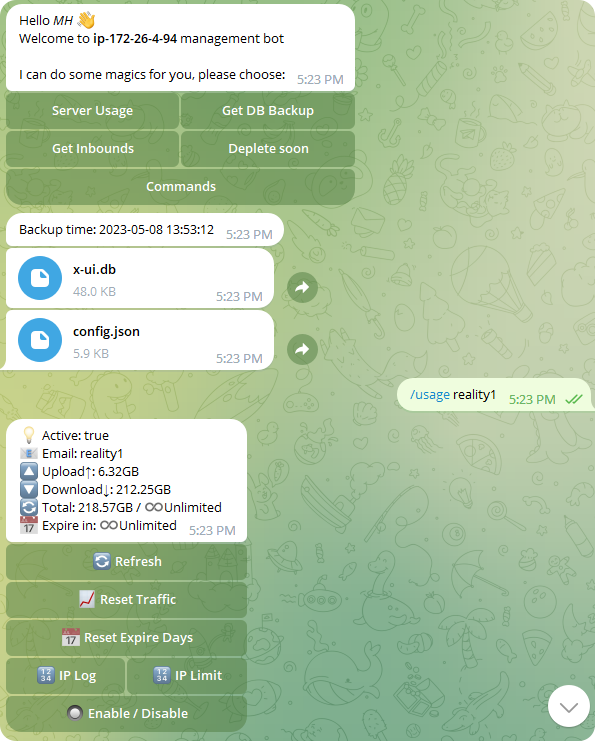

[English](/README.md) | [中文](/README.zh_CN.md) | [Español](/README.es_ES.md) | [Русский](/README.ru_RU.md)

<p align="center">
  <picture>
    <source media="(prefers-color-scheme: dark)" srcset="./media/3x-ui-dark.png">
    
  </picture>
</p>

**Un Panel Web Avanzado • Construido sobre Xray Core**

[](https://github.com/MHSanaei/3x-ui/releases)
[](#)
[](#)
[](#)
[](https://www.gnu.org/licenses/gpl-3.0.en.html)

> **Descargo de responsabilidad:** Este proyecto es solo para aprendizaje personal y comunicación, por favor no lo uses con fines ilegales, por favor no lo uses en un entorno de producción

**Si este proyecto te es útil, podrías considerar darle una**:star2:

<p align="left">
  <a href="https://buymeacoffee.com/mhsanaei" target="_blank">
    
  </a>
</p>

- USDT (TRC20): `TXncxkvhkDWGts487Pjqq1qT9JmwRUz8CC`
- MATIC (polygon): `0x41C9548675D044c6Bfb425786C765bc37427256A`
- LTC (Litecoin): `ltc1q2ach7x6d2zq0n4l0t4zl7d7xe2s6fs7a3vspwv`

## Instalar y Actualizar

```
bash <(curl -Ls https://raw.githubusercontent.com/mhsanaei/3x-ui/master/install.sh)
```

## Instalar versión antigua (no recomendamos)

Para instalar la versión deseada, utiliza el siguiente comando de instalación. Por ejemplo, ver `v1.7.9`:

```
VERSION=v1.7.9 && <(curl -Ls "https://raw.githubusercontent.com/mhsanaei/3x-ui/$VERSION/install.sh") $VERSION
```

## Certificado SSL

<details>
  <summary>Haga clic para ver los detalles del certificado SSL</summary>

### ACME

Para gestionar certificados SSL utilizando ACME:

1. Asegúrate de que tu dominio esté correctamente resuelto al servidor.
2. Ejecuta el comando `x-ui` en la terminal y elige `Gestión de Certificados SSL`.
3. Se te presentarán las siguientes opciones:

   - **Get SSL:** Obtener certificados SSL.
   - **Revoke:** Revocar certificados SSL existentes.
   - **Force Renew:** Forzar la renovación de certificados SSL.
   - **Show Existing Domains:** Mostrar todos los certificados de dominio disponibles en el servidor.  
   - **Set Certificate Paths for the Panel:** Especificar el certificado para tu dominio que será utilizado por el panel. 

### Certbot

Para instalar y usar Certbot:

```sh
apt-get install certbot -y
certbot certonly --standalone --agree-tos --register-unsafely-without-email -d yourdomain.com
certbot renew --dry-run
```

### Cloudflare

El script de gestión incluye una aplicación de certificado SSL integrada para Cloudflare. Para usar este script para solicitar un certificado, necesitas lo siguiente:

- Correo electrónico registrado en Cloudflare
- Clave API Global de Cloudflare
- El nombre de dominio debe estar resuelto al servidor actual a través de Cloudflare

**Cómo obtener la Clave API Global de Cloudflare:**

1. Ejecuta el comando `x-ui` en la terminal y elige `Certificado SSL de Cloudflare`.
2. Visita el enlace: [Tokens de API de Cloudflare](https://dash.cloudflare.com/profile/api-tokens).
3. Haz clic en "Ver Clave API Global" (consulta la captura de pantalla a continuación):
   
4. Es posible que necesites volver a autenticar tu cuenta. Después de eso, se mostrará la Clave API (consulta la captura de pantalla a continuación):
   

Al utilizarlo, simplemente ingresa tu `nombre de dominio`, `correo electrónico` y `CLAVE API`. El diagrama es el siguiente:
   

</details>

## Instalación y Actualización Manual

<details>
  <summary>Haz clic para más detalles de la instalación manual</summary>

#### Uso

1. Para descargar la última versión del paquete comprimido directamente en tu servidor, ejecuta el siguiente comando:

```sh
ARCH=$(uname -m)
case "${ARCH}" in
  x86_64 | x64 | amd64) XUI_ARCH="amd64" ;;
  i*86 | x86) XUI_ARCH="386" ;;
  armv8* | armv8 | arm64 | aarch64) XUI_ARCH="arm64" ;;
  armv7* | armv7) XUI_ARCH="armv7" ;;
  armv6* | armv6) XUI_ARCH="armv6" ;;
  armv5* | armv5) XUI_ARCH="armv5" ;;
  *) XUI_ARCH="amd64" ;;
esac


wget https://github.com/MHSanaei/3x-ui/releases/latest/download/x-ui-linux-${XUI_ARCH}.tar.gz
```

2. Una vez que se haya descargado el paquete comprimido, ejecuta los siguientes comandos para instalar o actualizar x-ui:

```sh
ARCH=$(uname -m)
case "${ARCH}" in
  x86_64 | x64 | amd64) XUI_ARCH="amd64" ;;
  i*86 | x86) XUI_ARCH="386" ;;
  armv8* | armv8 | arm64 | aarch64) XUI_ARCH="arm64" ;;
  armv7* | armv7) XUI_ARCH="armv7" ;;
  armv6* | armv6) XUI_ARCH="armv6" ;;
  armv5* | armv5) XUI_ARCH="armv5" ;;
  *) XUI_ARCH="amd64" ;;
esac

cd /root/
rm -rf x-ui/ /usr/local/x-ui/ /usr/bin/x-ui
tar zxvf x-ui-linux-${XUI_ARCH}.tar.gz
chmod +x x-ui/x-ui x-ui/bin/xray-linux-* x-ui/x-ui.sh
cp x-ui/x-ui.sh /usr/bin/x-ui
cp -f x-ui/x-ui.service /etc/systemd/system/
mv x-ui/ /usr/local/
systemctl daemon-reload
systemctl enable x-ui
systemctl restart x-ui
```

</details>

## Instalar con Docker

<details>
  <summary>Haz clic para más detalles del Docker</summary>

#### Uso

1. Instala Docker:

   ```sh
   bash <(curl -sSL https://get.docker.com)
   ```

2. Clona el Repositorio del Proyecto:

   ```sh
   git clone https://github.com/MHSanaei/3x-ui.git
   cd 3x-ui
   ```

3. Inicia el Servicio

   ```sh
   docker compose up -d
   ```

   O tambien

   ```sh
   docker run -itd \
      -e XRAY_VMESS_AEAD_FORCED=false \
      -v $PWD/db/:/etc/x-ui/ \
      -v $PWD/cert/:/root/cert/ \
      --network=host \
      --restart=unless-stopped \
      --name 3x-ui \
      ghcr.io/mhsanaei/3x-ui:latest
   ```

actualizar a la última versión

   ```sh
    cd 3x-ui
    docker compose down
    docker compose pull 3x-ui
    docker compose up -d
   ```

eliminar 3x-ui de docker

   ```sh
    docker stop 3x-ui
    docker rm 3x-ui
    cd --
    rm -r 3x-ui
   ```

</details>

## Configuración de Nginx
<details>
  <summary>Haga clic aquí para configurar el proxy inverso</summary>

#### Proxy inverso Nginx
```nginx
location / {
    proxy_set_header X-Forwarded-For $proxy_add_x_forwarded_for;
    proxy_set_header X-Forwarded-Proto $scheme;
    proxy_set_header Host $http_host;
    proxy_set_header X-Real-IP $remote_addr;
    proxy_set_header Range $http_range;
    proxy_set_header If-Range $http_if_range; 
    proxy_redirect off;
    proxy_pass http://127.0.0.1:2053;
}
```

#### Nginx sub-path
- EAsegúrese de que la "Ruta Raíz de la URL del Panel" en la configuración del panel `/sub` es la misma.
- El `url` en la configuración del panel debe terminar con `/`.   

```nginx
location /sub {
    proxy_set_header X-Forwarded-For $proxy_add_x_forwarded_for;
    proxy_set_header X-Forwarded-Proto $scheme;
    proxy_set_header Host $http_host;
    proxy_set_header X-Real-IP $remote_addr;
    proxy_set_header Range $http_range;
    proxy_set_header If-Range $http_if_range; 
    proxy_redirect off;
    proxy_pass http://127.0.0.1:2053;
}
```
</details>

## SO Recomendados

- Ubuntu 20.04+
- Debian 11+
- CentOS 8+
- OpenEuler 22.03+
- Fedora 36+
- Arch Linux
- Parch Linux
- Manjaro
- Armbian
- AlmaLinux 8.0+
- Rocky Linux 8+
- Oracle Linux 8+
- OpenSUSE Tubleweed
- Amazon Linux 2023
- Windows x64

## Arquitecturas y Dispositivos Compatibles

<details>
  <summary>Haz clic para detalles de arquitecturas y dispositivos compatibles</summary>

Nuestra plataforma ofrece compatibilidad con una amplia gama de arquitecturas y dispositivos, garantizando flexibilidad en diversos entornos informáticos. A continuación se presentan las principales arquitecturas que admitimos:

- **amd64**: Esta arquitectura predominante es la estándar para computadoras personales y servidores, y admite la mayoría de los sistemas operativos modernos sin problemas.

- **x86 / i386**: Ampliamente adoptada en computadoras de escritorio y portátiles, esta arquitectura cuenta con un amplio soporte de numerosos sistemas operativos y aplicaciones, incluidos, entre otros, Windows, macOS y sistemas Linux.

- **armv8 / arm64 / aarch64**: Diseñada para dispositivos móviles y embebidos contemporáneos, como teléfonos inteligentes y tabletas, esta arquitectura está ejemplificada por dispositivos como Raspberry Pi 4, Raspberry Pi 3, Raspberry Pi Zero 2/Zero 2 W, Orange Pi 3 LTS, entre otros.

- **armv7 / arm / arm32**: Sirve como arquitectura para dispositivos móviles y embebidos más antiguos, y sigue siendo ampliamente utilizada en dispositivos como Orange Pi Zero LTS, Orange Pi PC Plus, Raspberry Pi 2, entre otros.

- **armv6 / arm / arm32**: Orientada a dispositivos embebidos muy antiguos, esta arquitectura, aunque menos común, todavía se utiliza. Dispositivos como Raspberry Pi 1, Raspberry Pi Zero/Zero W, dependen de esta arquitectura.

- **armv5 / arm / arm32**: Una arquitectura más antigua asociada principalmente con sistemas embebidos tempranos, es menos común hoy en día pero aún puede encontrarse en dispositivos heredados como versiones antiguas de Raspberry Pi y algunos teléfonos inteligentes más antiguos.
</details>

## Idiomas

- English (inglés)  
- Persian (persa)  
- Traditional Chinese (chino tradicional)  
- Simplified Chinese (chino simplificado)  
- Japanese (japonés)  
- Russian (ruso)  
- Vietnamese (vietnamita)  
- Spanish (español)  
- Indonesian (indonesio)  
- Ukrainian (ucraniano)  
- Turkish (turco)  
- Português (Brazil) (portugués (Brasil))  


## Características

- Monitoreo del Estado del Sistema
- Búsqueda dentro de todas las reglas de entrada y clientes
- Tema Oscuro/Claro
- Soporta multiusuario y multiprotocolo
- Soporta protocolos, incluyendo VMess, VLESS, Trojan, Shadowsocks, Dokodemo-door, Socks, HTTP, wireguard
- Soporta Protocolos nativos XTLS, incluyendo RPRX-Direct, Visión, REALITY
- Estadísticas de tráfico, límite de tráfico, límite de tiempo de vencimiento
- Plantillas de configuración de Xray personalizables
- Soporta acceso HTTPS al panel (dominio proporcionado por uno mismo + certificado SSL)
- Soporta la solicitud y renovación automática de certificados SSL con un clic
- Para elementos de configuración más avanzados, consulta el panel
- Corrige rutas de API (la configuración del usuario se creará con la API)
- Soporta cambiar las configuraciones por diferentes elementos proporcionados en el panel.
- Soporta exportar/importar base de datos desde el panel


## Configuración Predeterminada del Panel

<details>
  <summary>Haz clic para ver los detalles de la configuración predeterminada</summary>

### Nombre de usuario, Contraseña, Puerto y Ruta Base Web

Si elige no modificar estas configuraciones, se generarán aleatoriamente (esto no se aplica a Docker).

**Configuraciones predeterminadas para Docker:**
- **Nombre de usuario:** admin
- **Contraseña:** admin
- **Puerto:** 2053

### Gestión de la Base de Datos:

  Puedes realizar copias de seguridad y restauraciones de la base de datos directamente desde el panel.

- **Ruta de la Base de Datos:**
  - `/etc/x-ui/x-ui.db`

### Ruta Base Web

1. **Restablecer la Ruta Base Web:**
   - Abre tu terminal.
   - Ejecuta el comando `x-ui`.
   - Selecciona la opción `Restablecer la Ruta Base Web`.

2. **Generar o Personalizar la Ruta:**
   - La ruta se generará aleatoriamente, o puedes ingresar una ruta personalizada.

3. **Ver Configuración Actual:**
   - Para ver tu configuración actual, utiliza el comando `x-ui settings` en el terminal o selecciona `Ver Configuración Actual` en `x-ui`.

### Recomendación de Seguridad:
- Para mayor seguridad, utiliza una palabra larga y aleatoria en la estructura de tu URL.

**Ejemplos:**
- `http://ip:port/*webbasepath*/panel`
- `http://domain:port/*webbasepath*/panel`

</details>

## Configuración de WARP

<details>
  <summary>Haz clic para ver los detalles de la configuración de WARP</summary>

#### Uso

**Para versiones `v2.1.0` y posteriores:**

WARP está integrado, no se requiere instalación adicional. Simplemente habilita la configuración necesaria en el panel.

</details>

## Límite de IP

<details>
  <summary>Haz clic para ver los detalles del límite de IP</summary>

#### Uso

**Nota:** El Límite de IP no funcionará correctamente cuando uses Túnel IP.

- **Para versiones hasta `v1.6.1`:**
  - El límite de IP está integrado en el panel.

**Para versiones `v1.7.0` y posteriores:**

Para habilitar la funcionalidad de límite de IP, necesitas instalar `fail2ban` y los archivos requeridos siguiendo estos pasos:

1. Ejecuta el comando `x-ui` en el terminal, luego elige `Gestión de Límite de IP`.
2. Verás las siguientes opciones:

   - **Cambiar la Duración del Bloqueo:** Ajustar la duración de los bloqueos.
   - **Desbloquear a Todos:** Levantar todos los bloqueos actuales.
   - **Revisar los Registros:** Revisar los registros.
   - **Estado de Fail2ban:** Verificar el estado de `fail2ban`.
   - **Reiniciar Fail2ban:** Reiniciar el servicio `fail2ban`.
   - **Desinstalar Fail2ban:** Desinstalar Fail2ban con la configuración.

3. Agrega una ruta para el registro de acceso en el panel configurando `Xray Configs/log/Access log` a `./access.log`, luego guarda y reinicia Xray.

- **Para versiones anteriores a `v2.1.3`:**
  - Necesitas configurar manualmente la ruta del registro de acceso en tu configuración de Xray:

    ```sh
    "log": {
      "access": "./access.log",
      "dnsLog": false,
      "loglevel": "warning"
    },
    ```

- **Para versiones `v2.1.3` y posteriores:**
  - Hay una opción para configurar `access.log` directamente desde el panel.

</details>

## Bot de Telegram

<details>
  <summary>Haz clic para más detalles del bot de Telegram</summary>

#### Uso

El panel web admite tráfico diario, inicio de sesión en el panel, copia de seguridad de la base de datos, estado del sistema, información del cliente y otras notificaciones y funciones a través del Bot de Telegram. Para usar el bot, debes establecer los parámetros relacionados con el bot en el panel, que incluyen:

- Token de Telegram
- ID de chat de administrador(es)
- Hora de Notificación (en sintaxis cron)
- Notificación de Fecha de Caducidad
- Notificación de Capacidad de Tráfico
- Copia de seguridad de la base de datos
- Notificación de Carga de CPU


**Sintaxis de referencia:**

- `30 \* \* \* \* \*` - Notifica a los 30s de cada punto
- `0 \*/10 \* \* \* \*` - Notifica en el primer segundo de cada 10 minutos
- `@hourly` - Notificación por hora
- `@daily` - Notificación diaria (00:00 de la mañana)
- `@weekly` - Notificación semanal
- `@every 8h` - Notifica cada 8 horas

### Funcionalidades del Bot de Telegram

- Reporte periódico
- Notificación de inicio de sesión
- Notificación de umbral de CPU
- Umbral de Notificación para Fecha de Caducidad y Tráfico para informar con anticipación
- Soporte para menú de reporte de cliente si el nombre de usuario de Telegram del cliente se agrega a las configuraciones de usuario
- Soporte para reporte de tráfico de Telegram buscado con UUID (VMESS/VLESS) o Contraseña (TROJAN) - anónimamente
- Bot basado en menú
- Buscar cliente por correo electrónico (solo administrador)
- Ver todas las Entradas
- Ver estado del servidor
- Ver clientes agotados
- Recibir copia de seguridad bajo demanda y en informes periódicos
- Bot multilingüe

### Configuración del Bot de Telegram

- Inicia [Botfather](https://t.me/BotFather) en tu cuenta de Telegram:
    

- Crea un nuevo bot usando el comando /newbot: Te hará 2 preguntas, Un nombre y un nombre de usuario para tu bot. Ten en cuenta que el nombre de usuario debe terminar con la palabra "bot".
    

- Inicia el bot que acabas de crear. Puedes encontrar el enlace a tu bot aquí.
    

- Ingresa a tu panel y configura los ajustes del bot de Telegram como se muestra a continuación:


Ingresa el token de tu bot en el campo de entrada número 3.
Ingresa el ID de chat de usuario en el campo de entrada número 4. Las cuentas de Telegram con esta ID serán los administradores del bot. (Puedes ingresar más de uno, solo sepáralos con ,)

- ¿Cómo obtener el ID de chat de Telegram? Usa este [bot](https://t.me/useridinfobot), Inicia el bot y te dará el ID de chat del usuario de Telegram.


</details>

## Rutas de API

<details>
  <summary>Haz clic para más detalles de las rutas de API</summary>

#### Uso

- [Documentación de API](https://www.postman.com/hsanaei/3x-ui/collection/q1l5l0u/3x-ui)
- `/login` con `POST` datos de usuario: `{username: '', password: ''}` para iniciar sesión
- `/panel/api/inbounds` base para las siguientes acciones:

| Método | Ruta                               | Acción                                                    |
| :----: | ---------------------------------- | --------------------------------------------------------- |
| `GET`  | `"/list"`                          | Obtener todas los Entradas                                |
| `GET`  | `"/get/:id"`                       | Obtener Entrada con inbound.id                            |
| `GET`  | `"/getClientTraffics/:email"`      | Obtener Tráficos del Cliente con email                    |
| `GET`  | `"/createbackup"`                  | El bot de Telegram envía copia de seguridad a los admins  |
| `POST` | `"/add"`                           | Agregar Entrada                                           |
| `POST` | `"/del/:id"`                       | Eliminar Entrada                                          |
| `POST` | `"/update/:id"`                    | Actualizar Entrada                                        |
| `POST` | `"/clientIps/:email"`              | Dirección IP del Cliente                                  |
| `POST` | `"/clearClientIps/:email"`         | Borrar Dirección IP del Cliente                           |
| `POST` | `"/addClient"`                     | Agregar Cliente a la Entrada                              |
| `POST` | `"/:id/delClient/:clientId"`       | Eliminar Cliente por clientId\*                           |
| `POST` | `"/updateClient/:clientId"`        | Actualizar Cliente por clientId\*                         |
| `POST` | `"/:id/resetClientTraffic/:email"` | Restablecer Tráfico del Cliente                           |
| `POST` | `"/resetAllTraffics"`              | Restablecer tráfico de todos las Entradas                 |
| `POST` | `"/resetAllClientTraffics/:id"`    | Restablecer tráfico de todos los clientes en una Entrada  |
| `POST` | `"/delDepletedClients/:id"`        | Eliminar clientes agotados de la entrada (-1: todos)      |
| `POST` | `"/onlines"`                       | Obtener usuarios en línea (lista de correos electrónicos) |

\*- El campo `clientId` debe llenarse por:

- `client.id` para VMESS y VLESS
- `client.password` para TROJAN
- `client.email` para Shadowsocks

- [](https://app.getpostman.com/run-collection/5146551-dda3cab3-0e33-485f-96f9-d4262f437ac5?action=collection%2Ffork&source=rip_markdown&collection-url=entityId%3D5146551-dda3cab3-0e33-485f-96f9-d4262f437ac5%26entityType%3Dcollection%26workspaceId%3Dd64f609f-485a-4951-9b8f-876b3f917124)
</details>

## Variables de Entorno

<details>
  <summary>Haz clic para más detalles de las variables de entorno</summary>

#### Uso

| Variable       |                      Tipo                      | Predeterminado |
| -------------- | :--------------------------------------------: | :------------- |
| XUI_LOG_LEVEL  | `"debug"` \| `"info"` \| `"warn"` \| `"error"` | `"info"`       |
| XUI_DEBUG      |                   `boolean`                    | `false`        |
| XUI_BIN_FOLDER |                    `string`                    | `"bin"`        |
| XUI_DB_FOLDER  |                    `string`                    | `"/etc/x-ui"`  |
| XUI_LOG_FOLDER |                    `string`                    | `"/var/log"`   |

Ejemplo:

```sh
XUI_BIN_FOLDER="bin" XUI_DB_FOLDER="/etc/x-ui" go build main.go
```

</details>

## Vista previa

<picture>
  <source media="(prefers-color-scheme: dark)" srcset="./media/01-overview-dark.png">
  
</picture>
<picture>
  <source media="(prefers-color-scheme: dark)" srcset="./media/02-inbounds-dark.png">
  
</picture>
<picture>
  <source media="(prefers-color-scheme: dark)" srcset="./media/03-add-inbound-dark.png">
  
</picture>
<picture>
  <source media="(prefers-color-scheme: dark)" srcset="./media/04-add-client-dark.png">
  
</picture>
<picture>
  <source media="(prefers-color-scheme: dark)" srcset="./media/05-settings-dark.png">
  
</picture>
<picture>
  <source media="(prefers-color-scheme: dark)" srcset="./media/06-configs-dark.png">
  
</picture>
<picture>
  
</picture>

## Un agradecimiento especial a

- [alireza0](https://github.com/alireza0/)

## Reconocimientos

- [Iran v2ray rules](https://github.com/chocolate4u/Iran-v2ray-rules) (Licencia: **GPL-3.0**): _Reglas de enrutamiento mejoradas de v2ray/xray y v2ray/xray-clients con dominios iraníes integrados y un enfoque en seguridad y bloqueo de anuncios._
- [Vietnam Adblock rules](https://github.com/vuong2023/vn-v2ray-rules) (License: **GPL-3.0**): _Un dominio alojado en Vietnam y una lista de bloqueo con la máxima eficiencia para vietnamitas._

## Estrellas a lo largo del tiempo

[](https://starchart.cc/MHSanaei/3x-ui)
