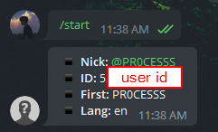
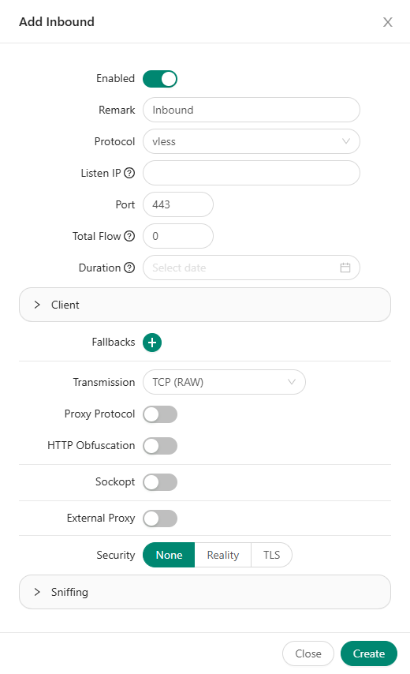

[English](/README.md) | [中文](/README.zh_CN.md) | [Español](/README.es_ES.md) | [Русский](/README.ru_RU.md)

<p align="center">
  <picture>
    <source media="(prefers-color-scheme: dark)" srcset="./media/3x-ui-dark.png">
    
  </picture>
</p>

**An Advanced Web Panel • Built on Xray Core**

[](https://github.com/MHSanaei/3x-ui/releases)
[](#)
[](#)
[](#)
[](https://www.gnu.org/licenses/gpl-3.0.en.html)

> **Disclaimer:** This project is only for personal learning and communication, please do not use it for illegal purposes, please do not use it in a production environment

**If this project is helpful to you, you may wish to give it a**:star2:

<p align="left">
  <a href="https://buymeacoffee.com/mhsanaei" target="_blank">
    
  </a>
</p>

- USDT (TRC20): `TXncxkvhkDWGts487Pjqq1qT9JmwRUz8CC`
- MATIC (polygon): `0x41C9548675D044c6Bfb425786C765bc37427256A`
- LTC (Litecoin): `ltc1q2ach7x6d2zq0n4l0t4zl7d7xe2s6fs7a3vspwv`

## Install & Upgrade

```
bash <(curl -Ls https://raw.githubusercontent.com/mhsanaei/3x-ui/master/install.sh)
```

## Install legacy Version (we don't recommend)

To install your desired version, use following installation command. e.g., ver `v1.7.9`:

```
VERSION=v1.7.9 && bash <(curl -Ls "https://raw.githubusercontent.com/mhsanaei/3x-ui/$VERSION/install.sh") $VERSION
```

## SSL Certificate

<details>
  <summary>Click for SSL Certificate details</summary>

### ACME

To manage SSL certificates using ACME:

1. Ensure your domain is correctly resolved to the server.
2. Run the `x-ui` command in the terminal, then choose `SSL Certificate Management`.
3. You will be presented with the following options:

   - **Get SSL:** Obtain SSL certificates.
   - **Revoke:** Revoke existing SSL certificates.
   - **Force Renew:** Force renewal of SSL certificates.
   - **Show Existing Domains:** Display all domain certificates available on the server.  
   - **Set Certificate Paths for the Panel:** Specify the certificate for your domain to be used by the panel. 

### Certbot

To install and use Certbot:

```sh
apt-get install certbot -y
certbot certonly --standalone --agree-tos --register-unsafely-without-email -d yourdomain.com
certbot renew --dry-run
```

### Cloudflare

The management script includes a built-in SSL certificate application for Cloudflare. To use this script to apply for a certificate, you need the following:

- Cloudflare registered email
- Cloudflare Global API Key
- The domain name must be resolved to the current server through Cloudflare

**How to get the Cloudflare Global API Key:**

1. Run the `x-ui` command in the terminal, then choose `Cloudflare SSL Certificate`.
2. Visit the link: [Cloudflare API Tokens](https://dash.cloudflare.com/profile/api-tokens).
3. Click on "View Global API Key" (see the screenshot below):
   
4. You may need to re-authenticate your account. After that, the API Key will be shown (see the screenshot below):
   

When using, just enter your `domain name`, `email`, and `API KEY`. The diagram is as follows:
   


</details>

## Manual Install & Upgrade

<details>
  <summary>Click for manual install details</summary>

#### Usage

1. To download the latest version of the compressed package directly to your server, run the following command:

```sh
ARCH=$(uname -m)
case "${ARCH}" in
  x86_64 | x64 | amd64) XUI_ARCH="amd64" ;;
  i*86 | x86) XUI_ARCH="386" ;;
  armv8* | armv8 | arm64 | aarch64) XUI_ARCH="arm64" ;;
  armv7* | armv7) XUI_ARCH="armv7" ;;
  armv6* | armv6) XUI_ARCH="armv6" ;;
  armv5* | armv5) XUI_ARCH="armv5" ;;
  s390x) echo 's390x' ;;
  *) XUI_ARCH="amd64" ;;
esac


wget https://github.com/MHSanaei/3x-ui/releases/latest/download/x-ui-linux-${XUI_ARCH}.tar.gz
```

2. Once the compressed package is downloaded, execute the following commands to install or upgrade x-ui:

```sh
ARCH=$(uname -m)
case "${ARCH}" in
  x86_64 | x64 | amd64) XUI_ARCH="amd64" ;;
  i*86 | x86) XUI_ARCH="386" ;;
  armv8* | armv8 | arm64 | aarch64) XUI_ARCH="arm64" ;;
  armv7* | armv7) XUI_ARCH="armv7" ;;
  armv6* | armv6) XUI_ARCH="armv6" ;;
  armv5* | armv5) XUI_ARCH="armv5" ;;
  s390x) echo 's390x' ;;
  *) XUI_ARCH="amd64" ;;
esac

cd /root/
rm -rf x-ui/ /usr/local/x-ui/ /usr/bin/x-ui
tar zxvf x-ui-linux-${XUI_ARCH}.tar.gz
chmod +x x-ui/x-ui x-ui/bin/xray-linux-* x-ui/x-ui.sh
cp x-ui/x-ui.sh /usr/bin/x-ui
cp -f x-ui/x-ui.service /etc/systemd/system/
mv x-ui/ /usr/local/
systemctl daemon-reload
systemctl enable x-ui
systemctl restart x-ui
```

</details>

## Install with Docker

<details>
  <summary>Click for Docker details</summary>

#### Usage

1. **Install Docker:**

   ```sh
   bash <(curl -sSL https://get.docker.com)
   ```

2. **Clone the Project Repository:**

   ```sh
   git clone https://github.com/MHSanaei/3x-ui.git
   cd 3x-ui
   ```

3. **Start the Service:**

   ```sh
   docker compose up -d
   ```

  Add ```--pull always``` flag to make docker automatically recreate container if a newer image is pulled. See https://docs.docker.com/reference/cli/docker/container/run/#pull for more info.

   **OR**

   ```sh
   docker run -itd \
      -e XRAY_VMESS_AEAD_FORCED=false \
      -v $PWD/db/:/etc/x-ui/ \
      -v $PWD/cert/:/root/cert/ \
      --network=host \
      --restart=unless-stopped \
      --name 3x-ui \
      ghcr.io/mhsanaei/3x-ui:latest
   ```

4. **Update to the Latest Version:**

   ```sh
   cd 3x-ui
   docker compose down
   docker compose pull 3x-ui
   docker compose up -d
   ```

5. **Remove 3x-ui from Docker:**

   ```sh
   docker stop 3x-ui
   docker rm 3x-ui
   cd --
   rm -r 3x-ui
   ```

</details>

## Nginx Settings
<details>
  <summary>Click for Reverse Proxy Configuration</summary>

#### Nginx Reverse Proxy
```nginx
location / {
    proxy_set_header X-Forwarded-For $proxy_add_x_forwarded_for;
    proxy_set_header X-Forwarded-Proto $scheme;
    proxy_set_header Host $http_host;
    proxy_set_header X-Real-IP $remote_addr;
    proxy_set_header Range $http_range;
    proxy_set_header If-Range $http_if_range; 
    proxy_redirect off;
    proxy_pass http://127.0.0.1:2053;
}
```

#### Nginx sub-path
- Ensure that the "URI Path" in the `/sub` panel settings is the same.
- The `url` in the panel settings needs to end with `/`.   

```nginx
location /sub {
    proxy_set_header X-Forwarded-For $proxy_add_x_forwarded_for;
    proxy_set_header X-Forwarded-Proto $scheme;
    proxy_set_header Host $http_host;
    proxy_set_header X-Real-IP $remote_addr;
    proxy_set_header Range $http_range;
    proxy_set_header If-Range $http_if_range; 
    proxy_redirect off;
    proxy_pass http://127.0.0.1:2053;
}
```
</details>

## Recommended OS

- Ubuntu 20.04+
- Debian 11+
- CentOS 8+
- OpenEuler 22.03+
- Fedora 36+
- Arch Linux
- Parch Linux
- Manjaro
- Armbian
- AlmaLinux 8.0+
- Rocky Linux 8+
- Oracle Linux 8+
- OpenSUSE Tubleweed
- Amazon Linux 2023
- Windows x64

## Supported Architectures and Devices

<details>
  <summary>Click for Supported Architectures and devices details</summary>

Our platform offers compatibility with a diverse range of architectures and devices, ensuring flexibility across various computing environments. The following are key architectures that we support:

- **amd64**: This prevalent architecture is the standard for personal computers and servers, accommodating most modern operating systems seamlessly.

- **x86 / i386**: Widely adopted in desktop and laptop computers, this architecture enjoys broad support from numerous operating systems and applications, including but not limited to Windows, macOS, and Linux systems.

- **armv8 / arm64 / aarch64**: Tailored for contemporary mobile and embedded devices, such as smartphones and tablets, this architecture is exemplified by devices like Raspberry Pi 4, Raspberry Pi 3, Raspberry Pi Zero 2/Zero 2 W, Orange Pi 3 LTS, and more.

- **armv7 / arm / arm32**: Serving as the architecture for older mobile and embedded devices, it remains widely utilized in devices like Orange Pi Zero LTS, Orange Pi PC Plus, Raspberry Pi 2, among others.

- **armv6 / arm / arm32**: Geared towards very old embedded devices, this architecture, while less prevalent, is still in use. Devices such as Raspberry Pi 1, Raspberry Pi Zero/Zero W, rely on this architecture.

- **armv5 / arm / arm32**: An older architecture primarily associated with early embedded systems, it is less common today but may still be found in legacy devices like early Raspberry Pi versions and some older smartphones.

- **s390x**: This architecture is commonly used in IBM mainframe computers and offers high performance and reliability for enterprise workloads.
</details>

## Languages

- English
- Persian
- Traditional Chinese
- Simplified Chinese
- Japanese
- Russian
- Vietnamese
- Spanish
- Indonesian
- Ukrainian
- Turkish
- Português (Brazil)


## Features

- System Status Monitoring
- Search within all inbounds and clients
- Dark/Light theme
- Supports multi-user and multi-protocol
- Supports protocols, including VMESS, VLESS, Trojan, Shadowsocks, Dokodemo-door, Socks, HTTP, wireguard
- Supports XTLS native Protocols, including RPRX-Direct, Vision, REALITY
- Traffic statistics, traffic limit, expiration time limit
- Customizable Xray configuration templates
- Supports HTTPS access panel (self-provided domain name + SSL certificate)
- Supports One-Click SSL certificate application and automatic renewal
- For more advanced configuration items, please refer to the panel
- Fixes API routes (user setting will be created with API)
- Supports changing configs by different items provided in the panel.
- Supports export/import database from the panel


## Default Panel Settings

<details>
  <summary>Click for default settings details</summary>

### Username, Password, Port, and Web Base Path

If you choose not to modify these settings, they will be generated randomly (this does not apply to Docker).

**Default Settings for Docker:**
- **Username:** admin
- **Password:** admin
- **Port:** 2053

### Database Management:

  You can conveniently perform database Backups and Restores directly from the panel.

- **Database Path:**
  - `/etc/x-ui/x-ui.db`


### Web Base Path

1. **Reset Web Base Path:**
   - Open your terminal.
   - Run the `x-ui` command.
   - Select the option to `Reset Web Base Path`.

2. **Generate or Customize Path:**
   - The path will be randomly generated, or you can enter a custom path.

3. **View Current Settings:**
   - To view your current settings, use the `x-ui settings` command in the terminal or `View Current Settings` in `x-ui`

### Security Recommendation:
- For enhanced security, use a long, random word in your URL structure.

**Examples:**
- `http://ip:port/*webbasepath*/panel`
- `http://domain:port/*webbasepath*/panel`

</details>

## WARP Configuration

<details>
  <summary>Click for WARP configuration details</summary>

#### Usage

**For versions `v2.1.0` and later:**

WARP is built-in, and no additional installation is required. Simply turn on the necessary configuration in the panel.

</details>

## IP Limit

<details>
  <summary>Click for IP limit details</summary>

#### Usage

**Note:** IP Limit won't work correctly when using IP Tunnel.

- **For versions up to `v1.6.1`:**
  - The IP limit is built-in to the panel

**For versions `v1.7.0` and newer:**

To enable the IP Limit functionality, you need to install `fail2ban` and its required files by following these steps:

1. Run the `x-ui` command in the terminal, then choose `IP Limit Management`.
2. You will see the following options:

   - **Change Ban Duration:** Adjust the duration of bans.
   - **Unban Everyone:** Lift all current bans.
   - **Check Logs:** Review the logs.
   - **Fail2ban Status:** Check the status of `fail2ban`.
   - **Restart Fail2ban:** Restart the `fail2ban` service.
   - **Uninstall Fail2ban:** Uninstall Fail2ban with configuration.

3. Add a path for the access log on the panel by setting `Xray Configs/log/Access log` to `./access.log` then save and restart xray.

- **For versions before `v2.1.3`:**
  - You need to set the access log path manually in your Xray configuration:

    ```sh
    "log": {
      "access": "./access.log",
      "dnsLog": false,
      "loglevel": "warning"
    },
    ```

- **For versions `v2.1.3` and newer:**
  - There is an option for configuring `access.log` directly from the panel.

</details>

## Telegram Bot

<details>
  <summary>Click for Telegram bot details</summary>

#### Usage

The web panel supports daily traffic, panel login, database backup, system status, client info, and other notification and functions through the Telegram Bot. To use the bot, you need to set the bot-related parameters in the panel, including:

- Telegram Token
- Admin Chat ID(s)
- Notification Time (in cron syntax)
- Expiration Date Notification
- Traffic Cap Notification
- Database Backup
- CPU Load Notification


**Reference syntax:**

- `30 \* \* \* \* \*` - Notify at the 30s of each point
- `0 \*/10 \* \* \* \*` - Notify at the first second of each 10 minutes
- `@hourly` - Hourly notification
- `@daily` - Daily notification (00:00 in the morning)
- `@weekly` - weekly notification
- `@every 8h` - Notify every 8 hours

### Telegram Bot Features

- Report periodic
- Login notification
- CPU threshold notification
- Threshold for Expiration time and Traffic to report in advance
- Support client report menu if client's telegram username added to the user's configurations
- Support telegram traffic report searched with UUID (VMESS/VLESS) or Password (TROJAN) - anonymously
- Menu-based bot
- Search client by email (only admin)
- Check all inbounds
- Check server status
- Check depleted users
- Receive backup by request and in periodic reports
- Multi-language bot

### Setting up Telegram bot

- Start [Botfather](https://t.me/BotFather) in your Telegram account:
    

- Create a new Bot using /newbot command: It will ask you 2 questions, A name and a username for your bot. Note that the username has to end with the word "bot".
    

- Start the bot you've just created. You can find the link to your bot here.
    

- Enter your panel and config Telegram bot settings like below:


Enter your bot token in input field number 3.
Enter the user ID in input field number 4. The Telegram accounts with this id will be the bot admin. (You can enter more than one, Just separate them with ,)

- How to get Telegram user ID? Use this [bot](https://t.me/useridinfobot), Start the bot and it will give you the Telegram user ID.


</details>

## API Routes

<details>
  <summary>Click for API routes details</summary>

#### Usage

- [API Documentation](https://www.postman.com/hsanaei/3x-ui/collection/q1l5l0u/3x-ui)
- `/login` with `POST` user data: `{username: '', password: ''}` for login
- `/panel/api/inbounds` base for following actions:

| Method | Path                               | Action                                      |
| :----: | ---------------------------------- | ------------------------------------------- |
| `GET`  | `"/list"`                          | Get all inbounds                            |
| `GET`  | `"/get/:id"`                       | Get inbound with inbound.id                 |
| `GET`  | `"/getClientTraffics/:email"`      | Get Client Traffics with email              |
| `GET`  | `"/getClientTrafficsById/:id"`     | Get client's traffic By ID |
| `GET`  | `"/createbackup"`                  | Telegram bot sends backup to admins         |
| `POST` | `"/add"`                           | Add inbound                                 |
| `POST` | `"/del/:id"`                       | Delete Inbound                              |
| `POST` | `"/update/:id"`                    | Update Inbound                              |
| `POST` | `"/clientIps/:email"`              | Client Ip address                           |
| `POST` | `"/clearClientIps/:email"`         | Clear Client Ip address                     |
| `POST` | `"/addClient"`                     | Add Client to inbound                       |
| `POST` | `"/:id/delClient/:clientId"`       | Delete Client by clientId\*                 |
| `POST` | `"/updateClient/:clientId"`        | Update Client by clientId\*                 |
| `POST` | `"/:id/resetClientTraffic/:email"` | Reset Client's Traffic                      |
| `POST` | `"/resetAllTraffics"`              | Reset traffics of all inbounds              |
| `POST` | `"/resetAllClientTraffics/:id"`    | Reset traffics of all clients in an inbound |
| `POST` | `"/delDepletedClients/:id"`        | Delete inbound depleted clients (-1: all)   |
| `POST` | `"/onlines"`                       | Get Online users ( list of emails )         |

\*- The field `clientId` should be filled by:

- `client.id` for VMESS and VLESS
- `client.password` for TROJAN
- `client.email` for Shadowsocks

- [](https://app.getpostman.com/run-collection/5146551-dda3cab3-0e33-485f-96f9-d4262f437ac5?action=collection%2Ffork&source=rip_markdown&collection-url=entityId%3D5146551-dda3cab3-0e33-485f-96f9-d4262f437ac5%26entityType%3Dcollection%26workspaceId%3Dd64f609f-485a-4951-9b8f-876b3f917124)
</details>

## Environment Variables

<details>
  <summary>Click for environment variables details</summary>

#### Usage

| Variable       |                      Type                      | Default       |
| -------------- | :--------------------------------------------: | :------------ |
| XUI_LOG_LEVEL  | `"debug"` \| `"info"` \| `"warn"` \| `"error"` | `"info"`      |
| XUI_DEBUG      |                   `boolean`                    | `false`       |
| XUI_BIN_FOLDER |                    `string`                    | `"bin"`       |
| XUI_DB_FOLDER  |                    `string`                    | `"/etc/x-ui"` |
| XUI_LOG_FOLDER |                    `string`                    | `"/var/log"`  |

Example:

```sh
XUI_BIN_FOLDER="bin" XUI_DB_FOLDER="/etc/x-ui" go build main.go
```

</details>

## Preview

<picture>
  <source media="(prefers-color-scheme: dark)" srcset="./media/01-overview-dark.png">
  
</picture>
<picture>
  <source media="(prefers-color-scheme: dark)" srcset="./media/02-inbounds-dark.png">
  
</picture>
<picture>
  <source media="(prefers-color-scheme: dark)" srcset="./media/03-add-inbound-dark.png">
  
</picture>
<picture>
  <source media="(prefers-color-scheme: dark)" srcset="./media/04-add-client-dark.png">
  
</picture>
<picture>
  <source media="(prefers-color-scheme: dark)" srcset="./media/05-settings-dark.png">
  
</picture>
<picture>
  <source media="(prefers-color-scheme: dark)" srcset="./media/06-configs-dark.png">
  
</picture>
<picture>
  <source media="(prefers-color-scheme: dark)" srcset="./media/07-bot-dark.png">
  
</picture>

## A Special Thanks to

- [alireza0](https://github.com/alireza0/)

## Acknowledgment

- [Iran v2ray rules](https://github.com/chocolate4u/Iran-v2ray-rules) (License: **GPL-3.0**): _Enhanced v2ray/xray and v2ray/xray-clients routing rules with built-in Iranian domains and a focus on security and adblocking._
- [Russia v2ray rules](https://github.com/runetfreedom/russia-v2ray-rules-dat) (License: **GPL-3.0**): _This repository contains automatically updated V2Ray routing rules based on data on blocked domains and addresses in Russia._

## Stargazers over Time

[](https://starchart.cc/MHSanaei/3x-ui)