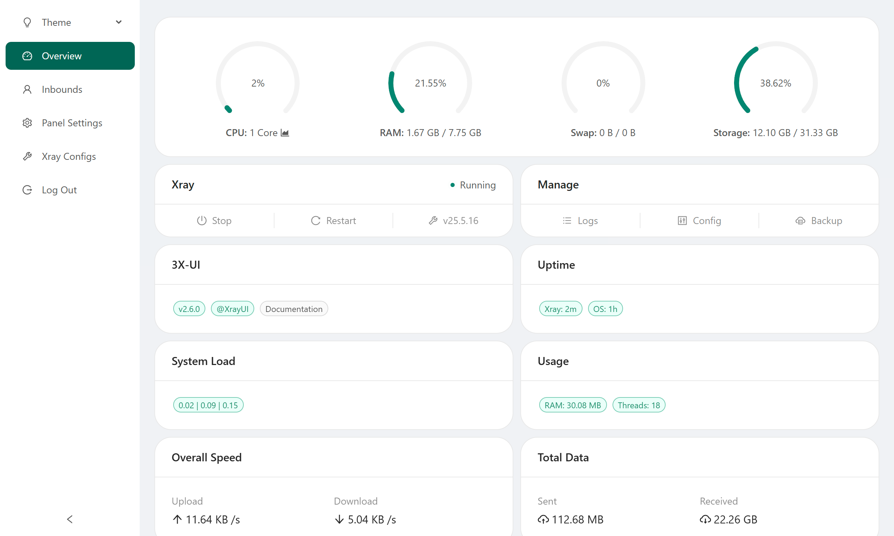

[English](/README.md) | [فارسی](/README.fa_IR.md) | [العربية](/README.ar_EG.md) |  [中文](/README.zh_CN.md) | [Español](/README.es_ES.md) | [Русский](/README.ru_RU.md) 

<p align="center">
  <picture>
    <source media="(prefers-color-scheme: dark)" srcset="./media/3x-ui-dark.png">
    
  </picture>
</p>

**An Advanced Web Panel • Built on Xray Core • With a Modern React/Next.js Frontend**

[](https://github.com/MHSanaei/3x-ui/releases)
[](#)
[](#)
[](#)
[](https://www.gnu.org/licenses/gpl-3.0.en.html)

> **Disclaimer:** This project is only for personal learning and communication, please do not use it for illegal purposes. Using it in a production environment is at your own risk.

**If this project is helpful to you, you may wish to give it a**:star2:

<p align="left">
  <a href="https://buymeacoffee.com/mhsanaei" target="_blank">
    
  </a>
</p>


## ✨ New Frontend!

This version of 3X-UI features a completely revamped frontend built with **React, Next.js, and Tailwind CSS**, offering a modern, responsive, and user-friendly experience. Key improvements include:
- Enhanced User Interface (UI) and User Experience (UX).
- Improved responsiveness for mobile and tablet devices.
- Integrated Dark Mode.
- Streamlined management of inbounds, clients, and settings.

## 🚀 Installation (Docker Based - Recommended)

This new version is designed to be run using Docker and Docker Compose for ease of installation, updates, and management.

**Prerequisites:**
- A Linux server (Ubuntu 22.04+, Debian 12+, CentOS 8+, Fedora 36+, or other compatible distributions).
- Root or sudo privileges.
- `curl` and `git` installed (the installation script will attempt to install them if missing).
- Docker and Docker Compose plugin (the installation script will attempt to install them if missing).

**Quick Install Command:**

```bash
bash <(curl -Ls https://raw.githubusercontent.com/santiyagoburcart/N-ui/main/install.sh)
```
*(Note: The URL should point to the new `install.sh` in the `main` branch or a specific release tag once updated).*

**Installation Steps Explained by the Script:**
1.  Checks for root privileges and essential tools (`curl`, `git`).
2.  Installs/Updates Docker and Docker Compose plugin if they are not present.
3.  Prompts you for an installation directory (default: `/opt/3x-ui-docker`).
4.  Clones (or updates an existing clone of) the 3x-ui repository into a source subdirectory (e.g., `3x-ui-source`).
5.  Navigates into the source directory.
6.  Creates necessary data directories (`db`, `cert`) for persistent storage.
7.  Prompts you for HOST ports for the new frontend (default: 3000) and the backend panel (default: 2053).
8.  Generates a `.env` file with these port configurations and sets up `NEXT_PUBLIC_API_BASE_URL` for communication between the frontend and backend containers.
9.  Runs `docker compose up -d --build --remove-orphans` to build the Docker images (for both backend and the new frontend) and start the services in detached mode.

After installation, the new frontend panel should be accessible at `http://<your_server_ip>:[FRONTEND_PORT]` (e.g., `http://<your_server_ip>:3000`).

## 🐳 Managing Services with Docker Compose

Once installed, you can manage the panel services using standard `docker compose` commands from within the source directory (e.g., `/opt/3x-ui-docker/3x-ui-source`):

- **Start services:** `docker compose up -d`
- **Stop services:** `docker compose stop`
- **Restart services:** `docker compose restart`
- **View logs for backend:** `docker compose logs -f backend`
- **View logs for frontend:** `docker compose logs -f frontend`
- **Update (rebuild and restart):**
  ```bash
  git pull # Get latest source
  docker compose up -d --build --remove-orphans # Rebuild images and restart
  ```
- **Uninstall:**
  ```bash
  docker compose down -v # Stops and removes containers, networks, and volumes
  # Then remove the installation directory if desired
  # cd .. && rm -rf /opt/3x-ui-docker
  ```

## ⚙️ Panel Configuration after Install

- **Initial Login:** Default credentials for the panel (if not changed during install script or via backend ENV) are usually `admin`/`admin`. Please change these immediately via the panel's "Settings" > "User Account" tab.
- **API URL:** The `NEXT_PUBLIC_API_BASE_URL` for the frontend is configured in the `.env` file created by the `install.sh` script. It points to the backend service within the Docker network (e.g., `http://backend:2053`).
- **Ports:** Host ports for frontend and backend are also defined in the `.env` file and used by `docker-compose.yml`.
- All other panel settings can be configured through the web interface in the "Settings" section.

## SSL Certificate

<details>
  <summary>Click for SSL Certificate details (General Guidance)</summary>

To secure your panel with an SSL certificate when using Docker:

1.  **Obtain SSL Certificates:** Use tools like Certbot (running on your host machine or in a separate Docker container) to obtain SSL certificates for your domain. Make sure your domain correctly resolves to your server's IP address.
2.  **Mount Certificates into Backend Container:**
    *   Place your certificate (`fullchain.pem` or `cert.pem`) and private key (`privkey.pem` or `key.pem`) files in a directory on your host machine (e.g., the `cert` directory created by `install.sh` at `$INSTALL_DIR/3x-ui-source/cert/`).
    *   The `docker-compose.yml` already mounts `./cert/:/root/cert/` into the backend container.
3.  **Configure Panel Settings:**
    *   In the 3X-UI panel settings (under "Panel Settings" tab), set:
        *   **Panel Domain:** Your domain (e.g., `panel.yourdomain.com`).
        *   **SSL Certificate File Path:** `/root/cert/your_cert.pem` (adjust filename accordingly).
        *   **SSL Key File Path:** `/root/cert/your_key.pem` (adjust filename accordingly).
    *   Save settings and restart the panel (the "Restart Panel" button in settings, or `docker compose restart backend`).
4.  **Access via HTTPS:** You should now be able to access your panel via `https://yourdomain.com:[FRONTEND_PORT]`. You might also need a reverse proxy (like Nginx or Traefik) in front of the frontend Docker container to handle SSL termination directly for the frontend port if desired, or configure the Next.js server itself for HTTPS if running standalone with more complex setup (not covered by default Dockerfile).

**Note:** The old ACME script (`x-ui ... SSL Certificate Management`) run directly from the binary might not work as expected within the Docker setup without further adaptation. Managing SSL certificates on the host or via a dedicated SSL reverse proxy container is generally recommended with Dockerized applications.

</details>

## Old Installation Methods (Legacy - Not Recommended for New Frontend)
<details>
  <summary>Click for legacy installation details (references old version)</summary>

The following installation methods refer to the previous version of 3X-UI with the older frontend. For the new React/Next.js frontend, please use the Docker-based installation described above.

```
# Legacy main install command
bash <(curl -Ls https://raw.githubusercontent.com/MHSanaei/3x-ui/refs/tags/v2.6.0/install.sh)
```

To install a specific legacy version, use following installation command. e.g., ver `v1.7.9`:
```
VERSION=v1.7.9 && bash <(curl -Ls "https://raw.githubusercontent.com/mhsanaei/3x-ui/$VERSION/install.sh") $VERSION
```

Manual installation of legacy versions also involved downloading pre-compiled binaries and setting up systemd services manually. This is no longer the recommended approach.

</details>


## Recommended OS (for Host running Docker)

- Ubuntu 22.04+
- Debian 12+
- CentOS 8+ / RHEL 8+ (or derivatives like AlmaLinux, Rocky Linux)
- Fedora 36+
- Other Linux distributions that support recent versions of Docker and Docker Compose.

## Features (New Frontend Highlights)

- System Status Monitoring (Real-time Dashboard)
- Comprehensive Inbound Management with dedicated UIs for VMESS, VLESS, Trojan, Shadowsocks clients.
- Streamlined Client Management within Inbounds (Add, Edit, Delete, Reset Traffic, QR Codes, Share Links).
- Full-Featured Settings Management via a tabbed interface (Panel, User Account & 2FA, Telegram Bot, Subscription Links, Other).
- Xray Log Viewer with filtering and download.
- Xray Version Management and GeoIP/GeoSite file updater.
- Dark/Light Theme.
- Responsive design for desktop, tablet, and mobile.
- Search within all inbounds and clients (To be verified/enhanced in new UI).
- Customizable Xray configuration templates (Via direct JSON editing in settings for now).
- Supports HTTPS access (Configuration via panel settings, assuming certs are mounted).
- Traffic statistics, traffic limit, expiration time limit for inbounds and clients.
- Export/Import database from the panel (API exists, UI to be added in "Other Features").

## Preview (New Frontend)

*(Screenshots for the new React/Next.js frontend will be added here soon. The existing screenshots below are for the older version.)*

<picture>
  <source media="(prefers-color-scheme: dark)" srcset="./media/01-overview-dark.png">
  
</picture>
<!-- ... other old screenshots ... -->


## A Special Thanks to

- [alireza0](https://github.com/alireza0/)
- All contributors and users of 3x-ui.

## Stargazers over Time

[](https://starchart.cc/MHSanaei/3x-ui)
