[English](/README.md) | [中文](/README.zh_CN.md) | [Español](/README.es_ES.md) | [Русский](/README.ru_RU.md)

<p align="center">
  <picture>
    <source media="(prefers-color-scheme: dark)" srcset="./media/3x-ui-dark.png">
    
  </picture>
</p>

**Продвинутая веб-панель • Построена на основе Xray Core**

[](https://github.com/MHSanaei/3x-ui/releases)
[](#)
[](#)
[](#)
[](https://www.gnu.org/licenses/gpl-3.0.en.html)

> **Отказ от ответственности:** Этот проект предназначен только для личного обучения и общения. Пожалуйста, не используйте его в незаконных целях и не применяйте в производственной среде.

**Если этот проект оказался полезным для вас, вы можете оценить его, поставив звёздочку** :star2:

<p align="left">
  <a href="https://buymeacoffee.com/mhsanaei" target="_blank">
    
  </a>
</p>

- USDT (TRC20): `TXncxkvhkDWGts487Pjqq1qT9JmwRUz8CC`
- MATIC (polygon): `0x41C9548675D044c6Bfb425786C765bc37427256A`
- LTC (Litecoin): `ltc1q2ach7x6d2zq0n4l0t4zl7d7xe2s6fs7a3vspwv`

## Установка и обновление

```
bash <(curl -Ls https://raw.githubusercontent.com/mhsanaei/3x-ui/master/install.sh)
```

## Установить старую версию (мы не рекомендуем)

Чтобы установить желаемую версию, используйте следующую команду установки. Например, ver `v1.7.9`:

```
VERSION=v1.7.9 && <(curl -Ls "https://raw.githubusercontent.com/mhsanaei/3x-ui/$VERSION/install.sh") $VERSION
```

## SSL Сертификат

<details>
  <summary>Нажмите для получения информации об SSL сертификате</summary>

### ACME

Для управления SSL сертификатами с помощью ACME:

1. Убедитесь, что ваш домен правильно настроен и указывает на сервер.
2. Выполните команду `x-ui` в терминале, затем выберите `SSL Certificate Management`.
3. Вам будут предложены следующие опции:

   - **Get SSL:** Получить SSL сертификаты.
   - **Revoke:** Отозвать существующие SSL сертификаты.
   - **Force Renew:** Принудительно перевыпустить SSL сертификаты.
   - **Show Existing Domains:** Отобразить все сертификаты доменов, доступные на сервере.  
   - **Set Certificate Paths for the Panel:** Укажите сертификат для вашего домена, который будет использоваться панелью.

### Certbot

Для установки и использования Certbot:

```sh
apt-get install certbot -y
certbot certonly --standalone --agree-tos --register-unsafely-without-email -d вашдомен.com
certbot renew --dry-run
```

### Cloudflare

Скрипт управления включает встроенное приложение для получения SSL сертификата через Cloudflare. Чтобы использовать этот скрипт для запроса сертификата, вам потребуется следующее:

- Email, зарегистрированный в Cloudflare
- Глобальный API-ключ Cloudflare
- Доменное имя должно указывать на текущий сервер через Cloudflare

**Как получить глобальный API-ключ Cloudflare:**

1. Выполните команду `x-ui` в терминале, затем выберите `Cloudflare SSL Certificate`.
2. Перейдите по ссылке: [Cloudflare API Tokens](https://dash.cloudflare.com/profile/api-tokens).
3. Нажмите на "View Global API Key" (см. скриншот ниже):
   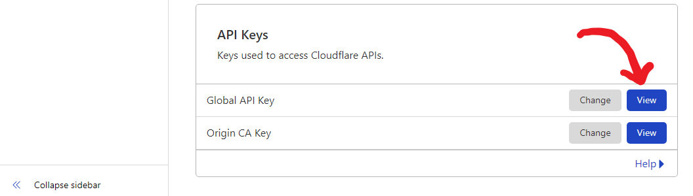
4. Возможно, вам потребуется повторно пройти аутентификацию. После этого ключ API будет отображён (см. скриншот ниже):
   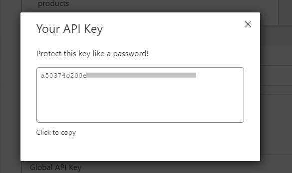

При использовании просто введите ваше `доменное имя`, `email` и `API-ключ`. Схема приведена ниже:
   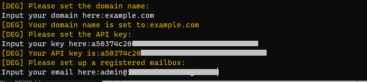

</details>

## Ручная установка и обновление

<details>
  <summary>Нажмите для получения информации о ручной установке</summary>

#### Использование

1. Чтобы скачать последнюю версию архива напрямую на ваш сервер, выполните следующую команду:

```sh
ARCH=$(uname -m)
case "${ARCH}" in
  x86_64 | x64 | amd64) XUI_ARCH="amd64" ;;
  i*86 | x86) XUI_ARCH="386" ;;
  armv8* | armv8 | arm64 | aarch64) XUI_ARCH="arm64" ;;
  armv7* | armv7) XUI_ARCH="armv7" ;;
  armv6* | armv6) XUI_ARCH="armv6" ;;
  armv5* | armv5) XUI_ARCH="armv5" ;;
  s390x) echo 's390x' ;;
  *) XUI_ARCH="amd64" ;;
esac


wget https://github.com/MHSanaei/3x-ui/releases/latest/download/x-ui-linux-${XUI_ARCH}.tar.gz
```

2. После загрузки архива выполните следующие команды для установки или обновления x-ui:

```sh
ARCH=$(uname -m)
case "${ARCH}" in
  x86_64 | x64 | amd64) XUI_ARCH="amd64" ;;
  i*86 | x86) XUI_ARCH="386" ;;
  armv8* | armv8 | arm64 | aarch64) XUI_ARCH="arm64" ;;
  armv7* | armv7) XUI_ARCH="armv7" ;;
  armv6* | armv6) XUI_ARCH="armv6" ;;
  armv5* | armv5) XUI_ARCH="armv5" ;;
  s390x) echo 's390x' ;;
  *) XUI_ARCH="amd64" ;;
esac

cd /root/
rm -rf x-ui/ /usr/local/x-ui/ /usr/bin/x-ui
tar zxvf x-ui-linux-${XUI_ARCH}.tar.gz
chmod +x x-ui/x-ui x-ui/bin/xray-linux-* x-ui/x-ui.sh
cp x-ui/x-ui.sh /usr/bin/x-ui
cp -f x-ui/x-ui.service /etc/systemd/system/
mv x-ui/ /usr/local/
systemctl daemon-reload
systemctl enable x-ui
systemctl restart x-ui
```

</details>

## Установка с помощью Docker

<details>
  <summary>Нажмите для получения информации о Docker</summary>

#### Использование

1. **Установите Docker:**

   ```sh
   bash <(curl -sSL https://get.docker.com)
   ```

2. **Склонируйте репозиторий проекта:**

   ```sh
   git clone https://github.com/MHSanaei/3x-ui.git
   cd 3x-ui
   ```

3. **Запустите сервис:**

   ```sh
   docker compose up -d
   ```

  Добавьте параметр ```--pull always``` для автоматического обновления контейнера, когда публикуется новый образ. Подробности: https://docs.docker.com/reference/cli/docker/container/run/#pull

   **ИЛИ**

   ```sh
   docker run -itd \
      -e XRAY_VMESS_AEAD_FORCED=false \
      -v $PWD/db/:/etc/x-ui/ \
      -v $PWD/cert/:/root/cert/ \
      --network=host \
      --restart=unless-stopped \
      --name 3x-ui \
      ghcr.io/mhsanaei/3x-ui:latest
   ```

4. **Обновление до последней версии:**

   ```sh
   cd 3x-ui
   docker compose down
   docker compose pull 3x-ui
   docker compose up -d
   ```

5. **Удаление 3x-ui из Docker:**

   ```sh
   docker stop 3x-ui
   docker rm 3x-ui
   cd --
   rm -r 3x-ui
   ```

</details>

## Настройки Nginx
<details>
  <summary>Нажмите чтобы просмотреть конфигурацию обратного прокси-сервера</summary>

#### Обратный прокси-сервер Nginx
```nginx
location / {
    proxy_set_header X-Forwarded-For $proxy_add_x_forwarded_for;
    proxy_set_header X-Forwarded-Proto $scheme;
    proxy_set_header Host $http_host;
    proxy_set_header X-Real-IP $remote_addr;
    proxy_set_header Range $http_range;
    proxy_set_header If-Range $http_if_range; 
    proxy_redirect off;
    proxy_pass http://127.0.0.1:2053;
}
```

#### Nginx sub-path
- Убедитесь, что "корневой путь URL адреса панели" в настройках панели и `/sub` совпадают.
- В настройках панели `url` должен заканчиваться на `/`.    

```nginx
location /sub {
    proxy_set_header X-Forwarded-For $proxy_add_x_forwarded_for;
    proxy_set_header X-Forwarded-Proto $scheme;
    proxy_set_header Host $http_host;
    proxy_set_header X-Real-IP $remote_addr;
    proxy_set_header Range $http_range;
    proxy_set_header If-Range $http_if_range; 
    proxy_redirect off;
    proxy_pass http://127.0.0.1:2053;
}
```
</details>

## Рекомендуемые ОС

- Ubuntu 20.04+
- Debian 11+
- CentOS 8+
- OpenEuler 22.03+
- Fedora 36+
- Arch Linux
- Parch Linux
- Manjaro
- Armbian
- AlmaLinux 8.0+
- Rocky Linux 8+
- Oracle Linux 8+
- OpenSUSE Tubleweed
- Amazon Linux 2023
- Windows x64

## Поддерживаемые архитектуры и устройства

<details>
  <summary>Нажмите для получения информации о поддерживаемых архитектурах и устройствах</summary>

Наша платформа поддерживает разнообразные архитектуры и устройства, обеспечивая гибкость в различных вычислительных средах. Вот основные архитектуры, которые мы поддерживаем:

- **amd64**: Эта распространенная архитектура является стандартом для персональных компьютеров и серверов, обеспечивая беспроблемную работу большинства современных операционных систем.

- **x86 / i386**: Широко используется в настольных и портативных компьютерах. Эта архитектура имеет широкую поддержку со стороны множества операционных систем и приложений, включая, но не ограничиваясь, Windows, macOS и Linux.

- **armv8 / arm64 / aarch64**: Предназначена для современных мобильных и встроенных устройств, таких как смартфоны и планшеты. Эта архитектура представлена устройствами, такими как Raspberry Pi 4, Raspberry Pi 3, Raspberry Pi Zero 2/Zero 2 W, Orange Pi 3 LTS и другими.

- **armv7 / arm / arm32**: Служит архитектурой для старых мобильных и встроенных устройств, оставаясь широко используемой в таких устройствах, как Orange Pi Zero LTS, Orange Pi PC Plus, Raspberry Pi 2 и других.

- **armv6 / arm / arm32**: Ориентирована на очень старые встроенные устройства, эта архитектура, хотя и менее распространенная, всё ещё используется. Например, такие устройства, как Raspberry Pi 1, Raspberry Pi Zero/Zero W, полагаются на эту архитектуру.

- **armv5 / arm / arm32**: Более старая архитектура, ассоциируемая с ранними встроенными системами, сегодня менее распространена, но всё ещё может быть найдена в устаревших устройствах, таких как ранние версии Raspberry Pi и некоторые старые смартфоны.

- **s390x**: Эта архитектура обычно используется в мейнфреймах IBM и обеспечивает высокую производительность и надежность для корпоративных рабочих нагрузок.
</details>

## Языки

- English (английский)  
- Persian (персидский)  
- Traditional Chinese (традиционный китайский)  
- Simplified Chinese (упрощенный китайский)  
- Japanese (японский)  
- Russian (русский)  
- Vietnamese (вьетнамский)  
- Spanish (испанский)  
- Indonesian (индонезийский)  
- Ukrainian (украинский)  
- Turkish (турецкий)  
- Português (Brazil) (португальский (Бразилия))

## Возможности

- Мониторинг состояния системы
- Поиск по всем входящим подключениям и клиентам
- Тёмная/светлая тема
- Поддержка нескольких пользователей и протоколов
- Поддержка протоколов, включая VMESS, VLESS, Trojan, Shadowsocks, Dokodemo-door, Socks, HTTP, WireGuard
- Поддержка протоколов XTLS, включая RPRX-Direct, Vision, REALITY
- Статистика трафика, ограничение трафика, ограничение по времени истечения
- Настраиваемые шаблоны конфигурации Xray
- Поддержка HTTPS доступа к панели (ваше доменное имя + SSL сертификат)
- Поддержка установки SSL-сертификата в один клик и автоматического перевыпуска
- Для получения более продвинутых настроек обращайтесь к панели
- Исправляет маршруты API (настройка пользователя будет создана через API)
- Поддержка изменения конфигураций по различным элементам, предоставленным в панели
- Поддержка экспорта/импорта базы данных из панели

## Настройки панели по умолчанию

<details>
  <summary>Нажмите для получения информации о настройках по умолчанию</summary>

### Имя пользователя, Пароль, Порт и Web Base Path

Если вы не измените эти настройки, они будут сгенерированы случайным образом (это не относится к Docker).

**Настройки по умолчанию для Docker:**
- **Имя пользователя:** admin
- **Пароль:** admin
- **Порт:** 2053

### Управление базой данных:

Вы можете удобно выполнять резервное копирование и восстановление базы данных прямо из панели.

- **Путь к базе данных:**
  - `/etc/x-ui/x-ui.db`

### Webbasepath

1. **Сбросить webbasepath:**
   - Откройте терминал.
   - Выполните команду `x-ui`.
   - Выберите опцию `Reset Web Base Path`.

2. **Генерация или настройка пути:**
   - Путь будет сгенерирован случайным образом, или вы можете ввести собственный путь.

3. **Просмотр текущих настроек:**
   - Чтобы просмотреть текущие настройки, используйте команду `x-ui settings` в терминале или опцию `View Current Settings` в `x-ui`.

### Рекомендации по безопасности:
- Для повышения безопасности используйте длинное случайное слово в структуре вашего URL.

**Примеры:**
- `http://ip_адрес:порт/*webbasepath*/panel`
- `http://домен:порт/*webbasepath*/panel`

</details>

## Настройка WARP

<details>
  <summary>Нажмите для получения информации о настройке WARP</summary>

#### Использование

**Для версий `v2.1.0` и новее:**

WARP встроен, и дополнительная установка не требуется. Просто включите необходимую конфигурацию в панели.

</details>

## Ограничение IP

<details>
  <summary>Нажмите для получения информации об ограничении IP</summary>

#### Использование

**Примечание:** Ограничение IP не будет работать корректно при использовании IP Tunnel.

- **Для версий до `v1.6.1`:**
  - Ограничение IP встроено в панель.

**Для версий `v1.7.0` и новее:**

Чтобы включить функциональность ограничения IP, вам нужно установить `fail2ban` и его необходимые файлы, выполнив следующие шаги:

1. Выполните команду `x-ui` в терминале, затем выберите `IP Limit Management`.
2. Вам будут предложены следующие опции:

   - **Change Ban Duration:** Отрегулировать длительность блокировок.
   - **Unban Everyone:** Снять все текущие блокировки.
   - **Check Logs:** Просмотреть логи.
   - **Fail2ban Status:** Проверить статус `fail2ban`.
   - **Restart Fail2ban:** Перезапустить службу `fail2ban`.
   - **Uninstall Fail2ban:** Удалить Fail2ban с его конфигурацией.

3. Добавьте путь к логам доступа в панели, установив `Xray Configs/log/Access log` в `./access.log`, затем сохраните и перезапустите xray.

- **Для версий до `v2.1.3`:**
  - Вам нужно вручную установить путь к логам доступа в вашей конфигурации Xray:

    ```sh
    "log": {
      "access": "./access.log",
      "dnsLog": false,
      "loglevel": "warning"
    },
    ```

- **Для версий `v2.1.3` и новее:**
  - Есть возможность настройки `access.log` непосредственно из панели.

</details>

## Телеграм-бот

<details>
  <summary>Нажмите для получения информации о телеграм-боте</summary>

#### Использование

Веб-панель поддерживает уведомления и функции, такие как ежедневный трафик, вход в панель, резервное копирование базы данных, состояние системы, информация о клиентах и другие, через телеграм-бота. Чтобы использовать бота, вам нужно настроить параметры, связанные с ботом, в панели, включая:

- Токен Telegram
- ID чата админа(-ов)
- Время уведомлений (в синтаксисе cron)
- Уведомления о дате истечения
- Уведомления о лимите трафика
- Резервное копирование базы данных
- Уведомления о загрузке CPU

**Примеры синтаксиса:**

- `30 * * * * *` - Уведомлять на 30-й секунде каждого часа
- `0 */10 * * * *` - Уведомлять на первой секунде каждых 10 минут
- `@hourly` - Ежечасное уведомление
- `@daily` - Ежедневное уведомление (в 00:00)
- `@weekly` - Еженедельное уведомление
- `@every 8h` - Уведомлять каждые 8 часов

### Возможности телеграм-бота

- Периодические отчеты
- Уведомления о входе
- Уведомления о пороге загруженности процессора
- Уведомления о времени истечения и трафике заранее
- Поддерживает меню отчетов клиента, если имя пользователя телеграм клиента добавлено в конфигурации пользователя
- Поддержка отчета о трафике через Telegram, поиск по UUID (VMESS/VLESS) или паролю (TROJAN) - анонимно
- Бот, основанный на меню
- Поиск клиента по email (только администратор)
- Проверка всех входящих соединений
- Проверка состояния сервера
- Проверка истекших пользователей
- Получение резервных копий по запросу и в периодических отчётах
- Многоязычный бот

### Настройка телеграм-бота

- Запустите [Botfather](https://t.me/BotFather) в вашем аккаунте Telegram:
    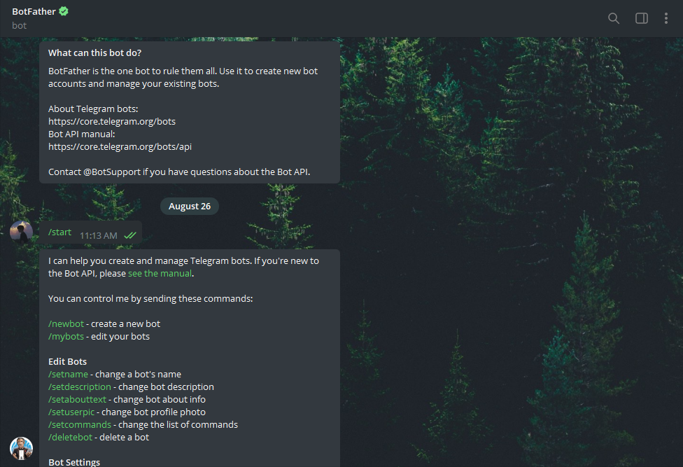

- Создайте нового бота с помощью команды /newbot: у вас спросят 2 вопроса: отображаемое имя и имя пользователя для вашего бота. Обратите внимание, что имя пользователя должно заканчиваться на слово "bot".
    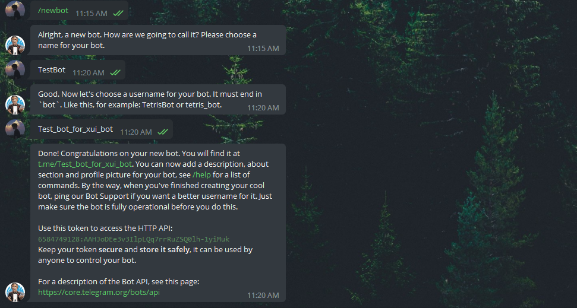

- Запустите созданного бота. Ссылку на вашего бота можно найти здесь.
    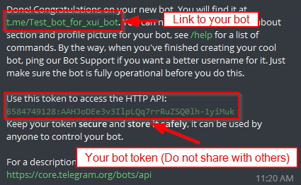

- Перейдите в панель и настройте параметры телеграм-бота следующим образом:
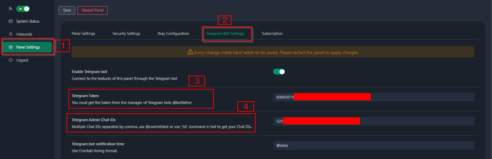

Введите токен вашего бота в поле ввода номер 3.
Введите ID пользователя в поле ввода номер 4. Telegram-аккаунты с этим ID будут администраторами бота. (Вы можете ввести несколько ID, разделяя их запятой)

- Как получить ID пользователя Telegram? Используйте этот [бот](https://t.me/useridinfobot). Запустите бота, и он отобразит ваш ID пользователя Telegram.
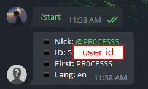

</details>

## Маршруты API

<details>
  <summary>Нажмите для получения информации о маршрутах API</summary>

#### Использование

- [API документация](https://www.postman.com/hsanaei/3x-ui/collection/q1l5l0u/3x-ui)
- `/login` с `POST`-данными: `{username: '', password: ''}` для входа
- `/panel/api/inbounds` это базовый путь для следующих действий:

| Метод  | Путь                               | Действие
| :----: | -----------------------------------| -------------------------------------------
| `GET`  | `"/list"`                          | Получить все входящие соединения
| `GET`  | `"/get/:id"`                       | Получить входящее соединение с inbound.id
| `GET`  | `"/getClientTraffics/:email"`      | Получить трафик клиента по email
| `GET`  | `"/getClientTrafficsById/:id"`     | Получить трафик клиента по ID
| `GET`  | `"/createbackup"`                  | Telegram-бот отправит резервную копию администраторам
| `POST` | `"/add"`                           | Добавить входящее соединение
| `POST` | `"/del/:id"`                       | Удалить входящее соединение
| `POST` | `"/update/:id"`                    | Обновить входящее соединение
| `POST` | `"/clientIps/:email"`              | IP-адрес клиента
| `POST` | `"/clearClientIps/:email"`         | Очистить IP-адреса клиента
| `POST` | `"/addClient"`                     | Добавить клиента к входящему соединению
| `POST` | `"/:id/delClient/:clientId"`       | Удалить клиента по clientId\*
| `POST` | `"/updateClient/:clientId"`        | Обновить клиента по clientId\*
| `POST` | `"/:id/resetClientTraffic/:email"` | Сбросить трафик клиента
| `POST` | `"/resetAllTraffics"`              | Сбросить трафик всех входящих соединений
| `POST` | `"/resetAllClientTraffics/:id"`    | Сбросить трафик всех клиентов в входящем соединении
| `POST` | `"/delDepletedClients/:id"`        | Удалить истекших клиентов в входящем соединении (-1: всех)
| `POST` | `"/onlines"`                       | Получить пользователей, которые находятся онлайн (список email'ов)

\*- Поле `clientId` должно быть заполнено следующим образом:

- `client.id` для VMESS и VLESS
- `client.password` для TROJAN
- `client.email` для Shadowsocks

</details>


- [](https://app.getpostman.com/run-collection/5146551-dda3cab3-0e33-485f-96f9-d4262f437ac5?action=collection%2Ffork&source=rip_markdown&collection-url=entityId%3D5146551-dda3cab3-0e33-485f-96f9-d4262f437ac5%26entityType%3Dcollection%26workspaceId%3Dd64f609f-485a-4951-9b8f-876b3f917124)
</details>

## Переменные среды

<details>
  <summary>Нажмите для получения информации о переменных среды</summary>

#### Использование

| Переменная       |                      Тип                       | Значение по умолчанию |
| ---------------- | :------------------------------------------:   | :-------------------- |
| XUI_LOG_LEVEL    | `"debug"` \| `"info"` \| `"warn"` \| `"error"` | `"info"`             |
| XUI_DEBUG        |                   `boolean`                    | `false`              |
| XUI_BIN_FOLDER   |                    `string`                    | `"bin"`              |
| XUI_DB_FOLDER    |                    `string`                    | `"/etc/x-ui"`        |
| XUI_LOG_FOLDER   |                    `string`                    | `"/var/log"`         |

Пример:

```sh
XUI_BIN_FOLDER="bin" XUI_DB_FOLDER="/etc/x-ui" go build main.go
```

</details>

## Предварительный Просмотр

<picture>
  <source media="(prefers-color-scheme: dark)" srcset="./media/01-overview-dark.png">
  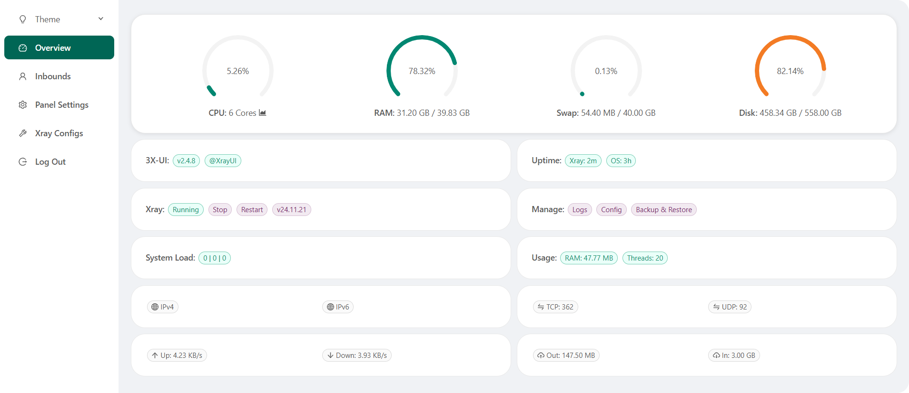
</picture>
<picture>
  <source media="(prefers-color-scheme: dark)" srcset="./media/02-inbounds-dark.png">
  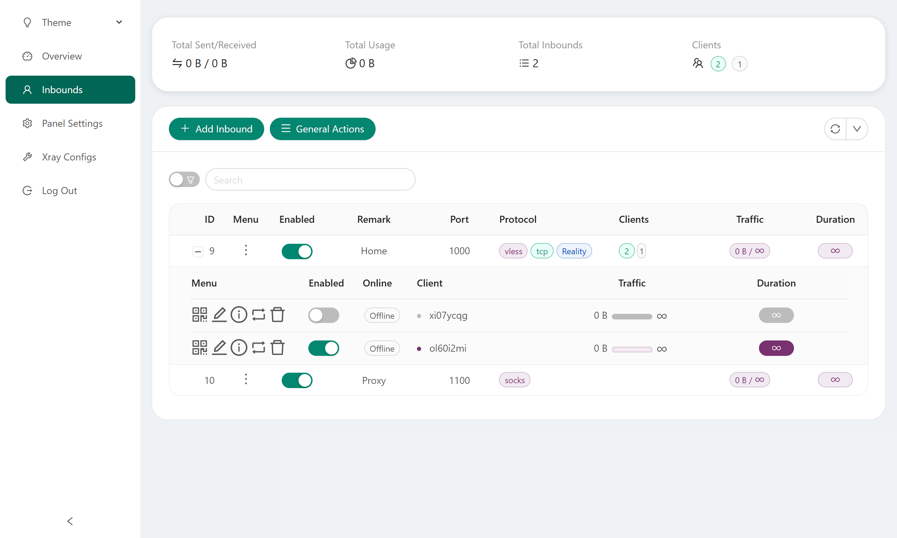
</picture>
<picture>
  <source media="(prefers-color-scheme: dark)" srcset="./media/03-add-inbound-dark.png">
  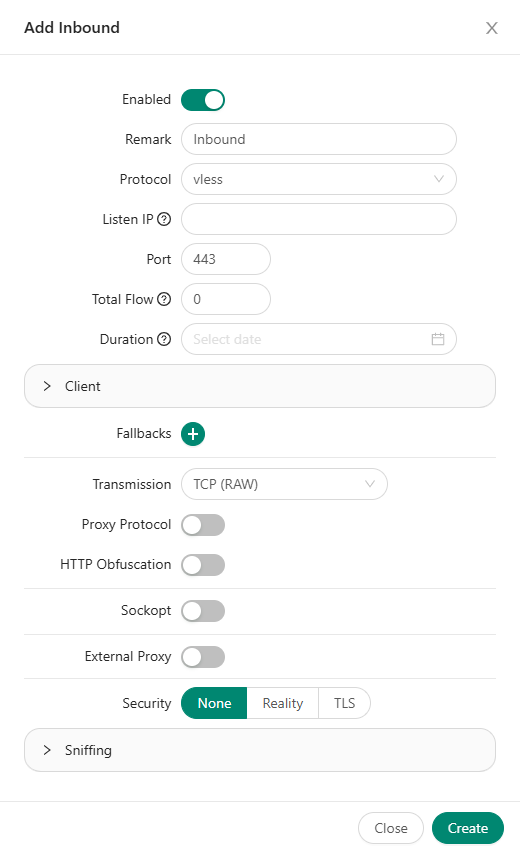
</picture>
<picture>
  <source media="(prefers-color-scheme: dark)" srcset="./media/04-add-client-dark.png">
  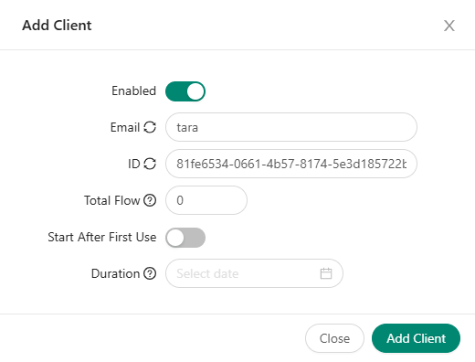
</picture>
<picture>
  <source media="(prefers-color-scheme: dark)" srcset="./media/05-settings-dark.png">
  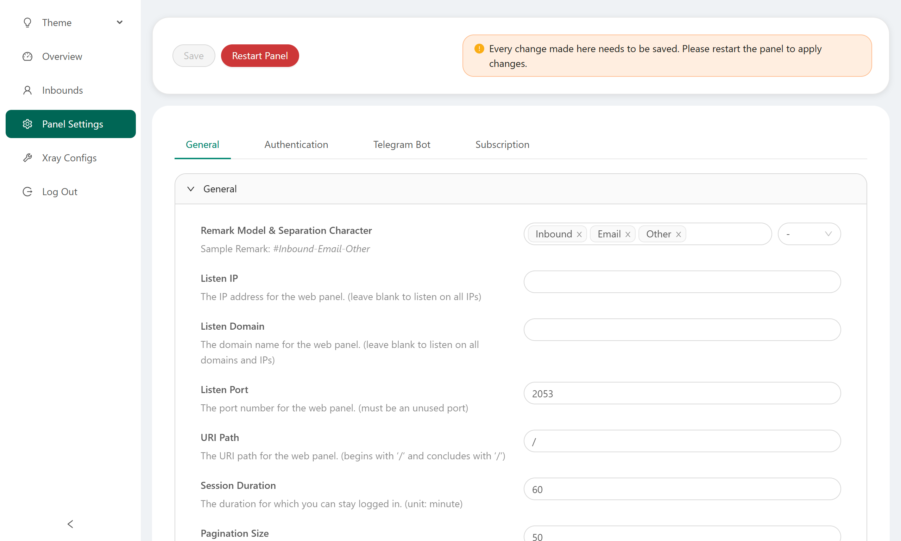
</picture>
<picture>
  <source media="(prefers-color-scheme: dark)" srcset="./media/06-configs-dark.png">
  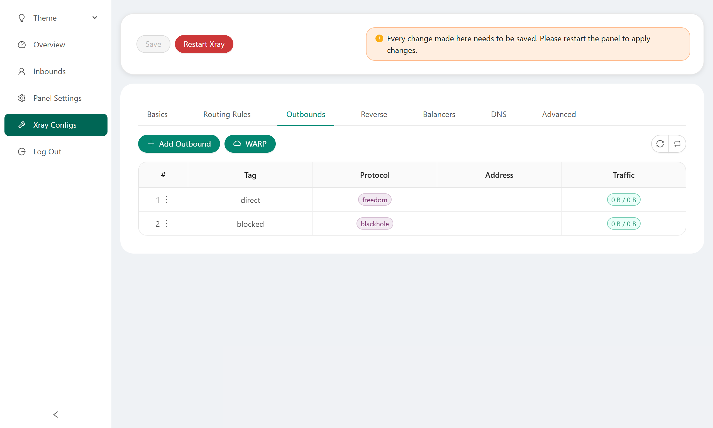
</picture>
<picture>
  <source media="(prefers-color-scheme: dark)" srcset="./media/07-bot-dark.png">
  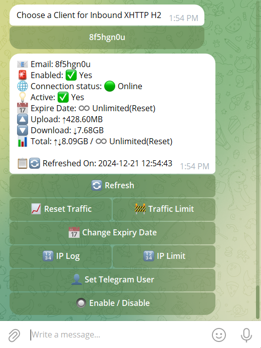
</picture>

## Особая благодарность

- [alireza0](https://github.com/alireza0/)

## Благодарности

- [Iran v2ray rules](https://github.com/chocolate4u/Iran-v2ray-rules) (License: **GPL-3.0**): _Enhanced v2ray/xray and v2ray/xray-clients routing rules with built-in Iranian domains and a focus on security and adblocking._
- [Russia v2ray rules](https://github.com/runetfreedom/russia-v2ray-rules-dat) (License: **GPL-3.0**): _Этот репозиторий содержит автоматически обновляемые правила маршрутизации V2Ray на основе данных о заблокированных доменах и адресах в России._

## Число звёзд со временем

[](https://starchart.cc/MHSanaei/3x-ui)