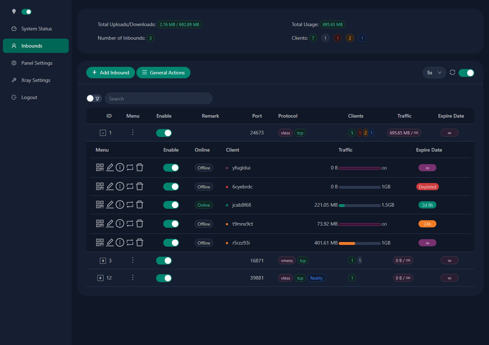
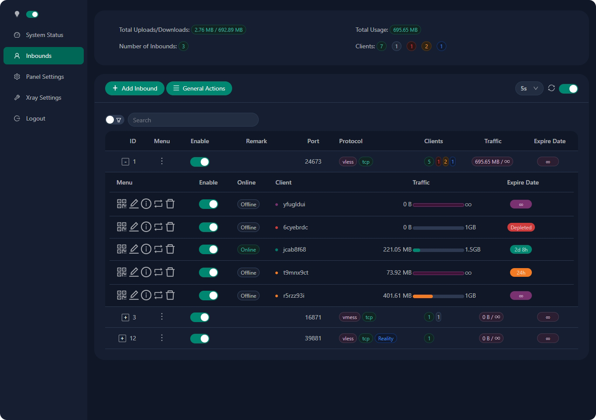
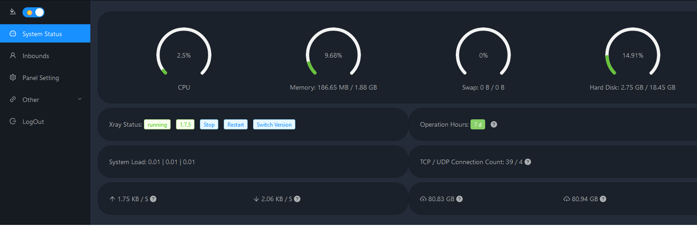
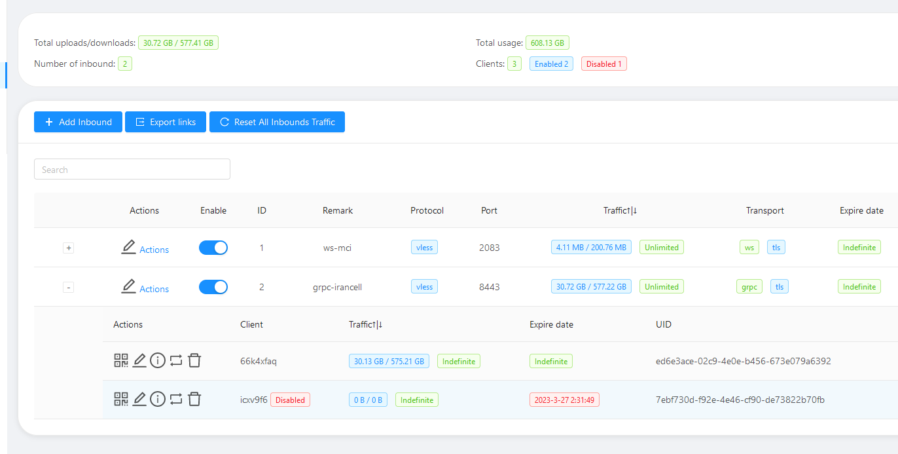
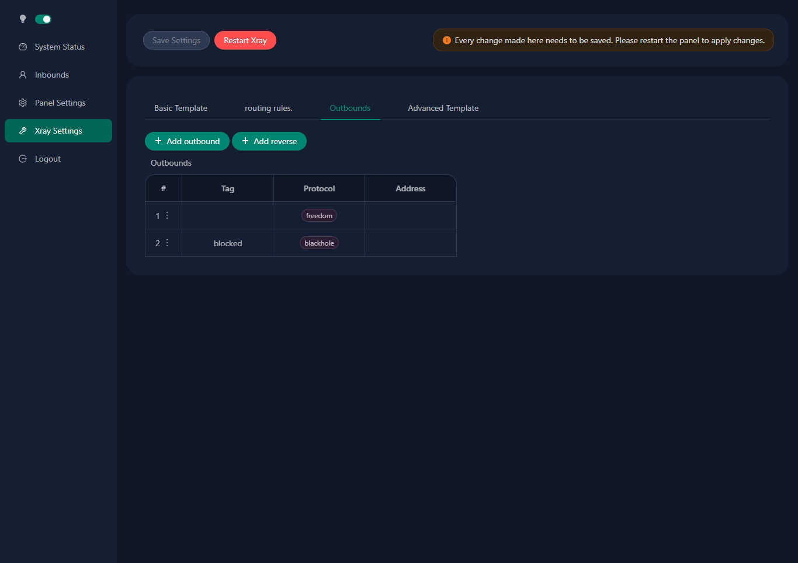
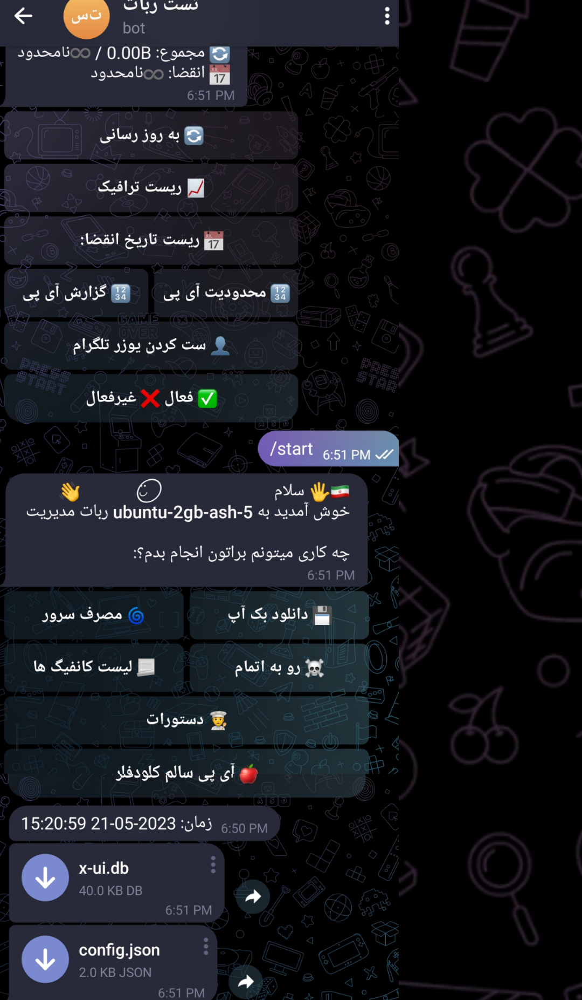

[English](/README.md) | [Chinese](/README.zh.md) | [Español](/README.es_ES.md)

<p align="center"><a href="#"></a></p>

**一个更好的面板 • 基于Xray Core构建**

[](https://github.com/MHSanaei/3x-ui/releases)
[](#)
[](#)
[](#)
[](https://www.gnu.org/licenses/gpl-3.0.en.html)

> **Disclaimer:** 此项目仅供个人学习交流，请不要用于非法目的，请不要在生产环境中使用。

**如果此项目对你有用，请给一个**:star2:

<p align="left">
  <a href="https://buymeacoffee.com/mhsanaei" target="_blank">
    
  </a>
</p>

- USDT (TRC20): `TXncxkvhkDWGts487Pjqq1qT9JmwRUz8CC`
- MATIC (polygon): `0x41C9548675D044c6Bfb425786C765bc37427256A`
- LTC (Litecoin): `ltc1q2ach7x6d2zq0n4l0t4zl7d7xe2s6fs7a3vspwv`

## 安装 & 升级

```
bash <(curl -Ls https://raw.githubusercontent.com/mhsanaei/3x-ui/master/install.sh)
```

## 安装指定版本

要安装所需的版本，请将该版本添加到安装命令的末尾。 e.g., ver `v2.3.12`:

```
bash <(curl -Ls https://raw.githubusercontent.com/mhsanaei/3x-ui/master/install.sh) v2.3.12
```

## SSL 认证

<details>
  <summary>点击查看 SSL 认证</summary>

### Cloudflare

管理脚本具有用于 Cloudflare 的内置 SSL 证书应用程序。若要使用此脚本申请证书，需要满足以下条件：

- Cloudflare 邮箱地址
- Cloudflare Global API Key
- 域名已通过 cloudflare 解析到当前服务器

**1:** 在终端中运行`x-ui`， 选择 `Cloudflare SSL Certificate`.


### Certbot
```
apt-get install certbot -y
certbot certonly --standalone --agree-tos --register-unsafely-without-email -d yourdomain.com
certbot renew --dry-run
```

***Tip:*** *管理脚本具有 Certbot 。使用 `x-ui` 命令， 选择 `SSL Certificate Management`.*

</details>

## 手动安装 & 升级

<details>
  <summary>点击查看 手动安装 & 升级</summary>

#### 使用

1. 若要将最新版本的压缩包直接下载到服务器，请运行以下命令：

```sh
ARCH=$(uname -m)
case "${ARCH}" in
  x86_64 | x64 | amd64) XUI_ARCH="amd64" ;;
  i*86 | x86) XUI_ARCH="386" ;;
  armv8* | armv8 | arm64 | aarch64) XUI_ARCH="arm64" ;;
  armv7* | armv7) XUI_ARCH="armv7" ;;
  armv6* | armv6) XUI_ARCH="armv6" ;;
  armv5* | armv5) XUI_ARCH="armv5" ;;
  *) XUI_ARCH="amd64" ;;
esac


wget https://github.com/MHSanaei/3x-ui/releases/latest/download/x-ui-linux-${XUI_ARCH}.tar.gz
```

2. 下载压缩包后，执行以下命令安装或升级 x-ui：

```sh
ARCH=$(uname -m)
case "${ARCH}" in
  x86_64 | x64 | amd64) XUI_ARCH="amd64" ;;
  i*86 | x86) XUI_ARCH="386" ;;
  armv8* | armv8 | arm64 | aarch64) XUI_ARCH="arm64" ;;
  armv7* | armv7) XUI_ARCH="armv7" ;;
  armv6* | armv6) XUI_ARCH="armv6" ;;
  armv5* | armv5) XUI_ARCH="armv5" ;;
  *) XUI_ARCH="amd64" ;;
esac

cd /root/
rm -rf x-ui/ /usr/local/x-ui/ /usr/bin/x-ui
tar zxvf x-ui-linux-${XUI_ARCH}.tar.gz
chmod +x x-ui/x-ui x-ui/bin/xray-linux-* x-ui/x-ui.sh
cp x-ui/x-ui.sh /usr/bin/x-ui
cp -f x-ui/x-ui.service /etc/systemd/system/
mv x-ui/ /usr/local/
systemctl daemon-reload
systemctl enable x-ui
systemctl restart x-ui
```

</details>

## 通过Docker安装

<details>
  <summary>点击查看 通过Docker安装</summary>

#### 使用

1. 安装Docker：

   ```sh
   bash <(curl -sSL https://get.docker.com)
   ```

2. 克隆仓库：

   ```sh
   git clone https://github.com/MHSanaei/3x-ui.git
   cd 3x-ui
   ```

3. 运行服务：

   ```sh
   docker compose up -d
   ```

   或

   ```sh
   docker run -itd \
      -e XRAY_VMESS_AEAD_FORCED=false \
      -v $PWD/db/:/etc/x-ui/ \
      -v $PWD/cert/:/root/cert/ \
      --network=host \
      --restart=unless-stopped \
      --name 3x-ui \
      ghcr.io/mhsanaei/3x-ui:latest
   ```

更新至最新版本

   ```sh
    cd 3x-ui
    docker compose down
    docker compose pull 3x-ui
    docker compose up -d
   ```

从Docker中删除3x-ui 

   ```sh
    docker stop 3x-ui
    docker rm 3x-ui
    cd --
    rm -r 3x-ui
   ```

</details>


## 建议使用的操作系统

- Ubuntu 20.04+
- Debian 11+
- CentOS 8+
- Fedora 36+
- Arch Linux
- Manjaro
- Armbian
- AlmaLinux 9+
- Rockylinux 9+
- OpenSUSE Tubleweed

## 支持的架构和设备
<details>
  <summary>点击查看 支持的架构和设备</summary>

我们的平台提供与各种架构和设备的兼容性，确保在各种计算环境中的灵活性。以下是我们支持的关键架构：

- **amd64**: 这种流行的架构是个人计算机和服务器的标准，可以无缝地适应大多数现代操作系统。

- **x86 / i386**: 这种架构在台式机和笔记本电脑中被广泛采用，得到了众多操作系统和应用程序的广泛支持，包括但不限于 Windows、macOS 和 Linux 系统。

- **armv8 / arm64 / aarch64**: 这种架构专为智能手机和平板电脑等当代移动和嵌入式设备量身定制，以 Raspberry Pi 4、Raspberry Pi 3、Raspberry Pi Zero 2/Zero 2 W、Orange Pi 3 LTS 等设备为例。

- **armv7 / arm / arm32**: 作为较旧的移动和嵌入式设备的架构，它仍然广泛用于Orange Pi Zero LTS、Orange Pi PC Plus、Raspberry Pi 2等设备。

- **armv6 / arm / arm32**: 这种架构面向非常老旧的嵌入式设备，虽然不太普遍，但仍在使用中。Raspberry Pi 1、Raspberry Pi Zero/Zero W 等设备都依赖于这种架构。

- **armv5 / arm / arm32**: 它是一种主要与早期嵌入式系统相关的旧架构，目前不太常见，但仍可能出现在早期 Raspberry Pi 版本和一些旧智能手机等传统设备中。
</details>

## Languages

- English（英语）
- Farsi（伊朗语）
- Chinese（中文）
- Russian（俄语）
- Vietnamese（越南语）
- Spanish（西班牙语）
- Indonesian （印度尼西亚语）
- Ukrainian（乌克兰语）


## Features

- 系统状态监控
- 在所有入站和客户端中搜索
- 深色/浅色主题
- 支持多用户和多协议
- 支持多种协议，包括 VMess、VLESS、Trojan、Shadowsocks、Dokodemo-door、Socks、HTTP、wireguard
- 支持 XTLS 原生协议，包括 RPRX-Direct、Vision、REALITY
- 流量统计、流量限制、过期时间限制
- 可自定义的 Xray配置模板
- 支持HTTPS访问面板（自建域名+SSL证书）
- 支持一键式SSL证书申请和自动续费
- 更多高级配置项目请参考面板
- 修复了 API 路由（用户设置将使用 API 创建）
- 支持通过面板中提供的不同项目更改配置。
- 支持从面板导出/导入数据库


## 默认设置

<details>
  <summary>点击查看 默认设置</summary>

  ### 信息

- **端口：** 2053
- **用户名 & 密码：** 当您跳过设置时，此项会随机生成。
- **数据库路径：**
  - /etc/x-ui/x-ui.db
- **Xray 配置路径：**
  - /usr/local/x-ui/bin/config.json
- **面板链接（无SSL）：**
  - http://ip:2053/panel
  - http://domain:2053/panel
- **面板链接（有SSL）：**
  - https://domain:2053/panel
 
</details>

## WARP 配置

<details>
  <summary>点击查看 WARP 配置</summary>

#### 使用

如果要在 v2.1.0 之前使用 WARP 路由，请按照以下步骤操作：

**1.** 在 **SOCKS Proxy Mode** 模式中安装Wrap

   ```sh
   bash <(curl -sSL https://raw.githubusercontent.com/hamid-gh98/x-ui-scripts/main/install_warp_proxy.sh)
   ```

**2.** 如果您已经安装了 warp，您可以使用以下命令卸载：

   ```sh
   warp u
   ```

**3.** 在面板中打开您需要的配置

   配置:

   - Block Ads
   - Route Google + Netflix + Spotify + OpenAI (ChatGPT) to WARP
   - Fix Google 403 error

</details>

## IP 限制

<details>
  <summary>点击查看 IP 限制</summary>

#### 使用

**注意：** 使用 IP 隧道时，IP 限制无法正常工作。

- 适用于最高 `v1.6.1` ：

  - IP 限制 已被集成在面板中。

- 适用于 `v1.7.0` 以及更新的版本：

  - 要使 IP 限制正常工作，您需要按照以下步骤安装 fail2ban 及其所需的文件：

    1. 使用面板内置的 `x-ui` 指令
    2. 选择 `IP Limit Management`.
    3. 根据您的需要选择合适的选项。
   
  - 确保您的 Xray 配置上有 ./access.log 。在 v2.1.3 之后，我们有一个选项。
  
  ```sh
    "log": {
      "access": "./access.log",
      "dnsLog": false,
      "loglevel": "warning"
    },
  ```

</details>

## Telegram 机器人

<details>
  <summary>点击查看 Telegram 机器人</summary>

#### 使用

Web 面板通过 Telegram Bot 支持每日流量、面板登录、数据库备份、系统状态、客户端信息等通知和功能。要使用机器人，您需要在面板中设置机器人相关参数，包括：

- 电报令牌
- 管理员聊天 ID
- 通知时间（cron 语法）
- 到期日期通知
- 流量上限通知
- 数据库备份
- CPU 负载通知


**参考：**

- `30 \* \* \* \* \*` - 在每个点的 30 秒处通知
- `0 \*/10 \* \* \* \*` - 每 10 分钟的第一秒通知
- `@hourly` - 每小时通知
- `@daily` - 每天通知 (00:00)
- `@weekly` - 每周通知
- `@every 8h` - 每8小时通知

### Telegram Bot 功能

- 定期报告
- 登录通知
- CPU 阈值通知
- 提前报告的过期时间和流量阈值
- 如果将客户的电报用户名添加到用户的配置中，则支持客户端报告菜单
- 支持使用UUID（VMESS/VLESS）或密码（TROJAN）搜索报文流量报告 - 匿名
- 基于菜单的机器人
- 通过电子邮件搜索客户端（仅限管理员）
- 检查所有入库
- 检查服务器状态
- 检查耗尽的用户
- 根据请求和定期报告接收备份
- 多语言机器人

### 注册 Telegram bot

- 与 [Botfather](https://t.me/BotFather) 对话：
    
  
- 使用 /newbot 创建新机器人：你需要提供机器人名称以及用户名，注意名称中末尾要包含“bot”
    

- 启动您刚刚创建的机器人。可以在此处找到机器人的链接。
    

- 输入您的面板并配置 Telegram 机器人设置，如下所示：
    

在输入字段编号 3 中输入机器人令牌。
在输入字段编号 4 中输入用户 ID。具有此 id 的 Telegram 帐户将是机器人管理员。 （您可以输入多个，只需将它们用“ ，”分开即可）

- 如何获取TG ID? 使用 [bot](https://t.me/useridinfobot)， 启动机器人，它会给你 Telegram 用户 ID。


</details>

## API 路由

<details>
  <summary>点击查看 API 路由</summary>

#### 使用

- `/login` 使用 `POST` 用户名称 & 密码： `{username: '', password: ''}` 登录
- `/panel/api/inbounds` 以下操作的基础：

|  方法  | 路径                               | 操作                              |
| :----: | ---------------------------------- | --------------------------------- |
| `GET`  | `"/list"`                          | 获取所有入站                      |
| `GET`  | `"/get/:id"`                       | 获取所有入站以及inbound.id        |
| `GET`  | `"/getClientTraffics/:email"`      | 通过电子邮件获取客户端流量        |
| `GET`  | `"/createbackup"`                  | Telegram 机器人向管理员发送备份   |
| `POST` | `"/add"`                           | 添加入站                          |
| `POST` | `"/del/:id"`                       | 删除入站                          |
| `POST` | `"/update/:id"`                    | 更新入站                          |
| `POST` | `"/clientIps/:email"`              | 客户端 IP 地址                    |
| `POST` | `"/clearClientIps/:email"`         | 清除客户端 IP 地址                |
| `POST` | `"/addClient"`                     | 将客户端添加到入站                |
| `POST` | `"/:id/delClient/:clientId"`       | 通过 clientId\* 删除客户端        |
| `POST` | `"/updateClient/:clientId"`        | 通过 clientId\* 更新客户端        |
| `POST` | `"/:id/resetClientTraffic/:email"` | 重置客户端的流量                  |
| `POST` | `"/resetAllTraffics"`              | 重置所有入站的流量                |
| `POST` | `"/resetAllClientTraffics/:id"`    | 重置入站中所有客户端的流量        |
| `POST` | `"/delDepletedClients/:id"`        | 删除入站耗尽的客户端 （-1： all） |
| `POST` | `"/onlines"`                       | 获取在线用户 （ 电子邮件列表 ）   |

\*- `clientId` 项应该使用下列数据

- `client.id`  VMESS and VLESS
- `client.password`  TROJAN
- `client.email`  Shadowsocks


- [API 文档](https://documenter.getpostman.com/view/16802678/2s9YkgD5jm)
- [](https://app.getpostman.com/run-collection/16802678-1a4c9270-ac77-40ed-959a-7aa56dc4a415?action=collection%2Ffork&source=rip_markdown&collection-url=entityId%3D16802678-1a4c9270-ac77-40ed-959a-7aa56dc4a415%26entityType%3Dcollection%26workspaceId%3D2cd38c01-c851-4a15-a972-f181c23359d9)
</details>

## 环境变量

<details>
  <summary>点击查看 环境变量</summary>

#### Usage

| 变量           |                      Type                      | 默认          |
| -------------- | :--------------------------------------------: | :------------ |
| XUI_LOG_LEVEL  | `"debug"` \| `"info"` \| `"warn"` \| `"error"` | `"info"`      |
| XUI_DEBUG      |                   `boolean`                    | `false`       |
| XUI_BIN_FOLDER |                    `string`                    | `"bin"`       |
| XUI_DB_FOLDER  |                    `string`                    | `"/etc/x-ui"` |
| XUI_LOG_FOLDER |                    `string`                    | `"/var/log"`  |

例子：

```sh
XUI_BIN_FOLDER="bin" XUI_DB_FOLDER="/etc/x-ui" go build main.go
```

</details>

## 预览









## 特别感谢

- [alireza0](https://github.com/alireza0/)

## 致谢

- [Iran v2ray rules](https://github.com/chocolate4u/Iran-v2ray-rules) (License: **GPL-3.0**): _Enhanced v2ray/xray and v2ray/xray-clients routing rules with built-in Iranian domains and a focus on security and adblocking._
- [Vietnam Adblock rules](https://github.com/vuong2023/vn-v2ray-rules) (License: **GPL-3.0**): _A hosted domain hosted in Vietnam and blocklist with the most efficiency for Vietnamese._

## Star趋势

[](https://starchart.cc/MHSanaei/3x-ui)
